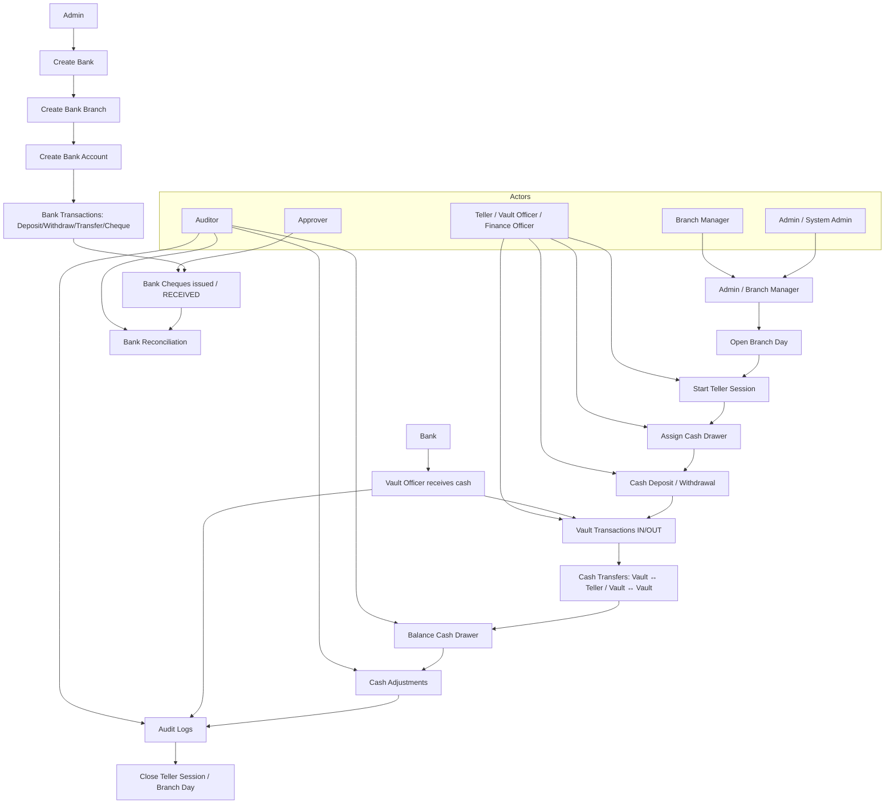

# Branch Finance System – Operational Flow

## Actors

- **Admin / System Admin** – manages banks, branches, and accounts
- **Branch Manager** – manages branch setup and oversight
- **Finance Officer / Teller / Vault Officer** – executes voucher_entries, manages vaults, teller sessions, and reconciliations
- **Approver** – approves cheques or high-value voucher_entries
- **Auditor** – verifies reconciliations and audits

---

## 1. Branch Cash & Vault Operations

### Flow Steps

1. **Open Branch Day**
    - **Actor:** Branch Manager / Admin
    - **Table:** `branch_days`
    - Description: The branch day is opened with a specific business date to track all cash operations.

2. **Start Teller Session**
    - **Actor:** Teller / Vault Officer
    - **Table:** `teller_sessions`
    - Description: Teller session begins with initial opening cash balance.

3. **Assign Cash Drawer**
    - **Actor:** Teller
    - **Table:** `cash_drawers`
    - Description: Each teller is assigned a cash drawer linked to a vault.

4. **Record Vault Denominations**
    - **Actor:** Vault Officer
    - **Table:** `vault_denominations`
    - Description: Denominations of notes/coins in the vault are recorded.

5. **Deposit / Withdraw Cash**
    - **Actor:** Teller / Finance Officer
    - **Table:** `cash_transactions`
    - Description: Cash movements in/out of the drawer are tracked.

6. **Vault Transactions (IN/OUT)**
    - **Actor:** Vault Officer
    - **Table:** `vault_transactions`
    - Description: Cash received into or transferred out of the vault is recorded.

7. **Cash Transfers**
    - **Actor:** Vault Officer
    - **Tables:** `teller_vault_transfers`, `vault_transfers`
    - Description: Funds move between vaults or between vault and teller.

8. **Balance Cash Drawer**
    - **Actor:** Teller / Vault Officer
    - **Table:** `cash_balancings`
    - Description: Physical cash counted and balanced against system records.

9. **Record Cash Adjustments**
    - **Actor:** Teller / Vault Officer
    - **Table:** `cash_adjustments`
    - Description: Shortages or excesses recorded with reason and approval.

10. **Audit Logs**
    - **Actor:** Auditor / Admin
    - **Table:** `cash_audit_logs`
    - Description: All critical actions are logged for auditing purposes.

11. **Close Teller Session / Branch Day**
    - **Actor:** Branch Manager / Teller
    - **Tables:** `teller_sessions`, `branch_days`
    - Description: Closing cash and end-of-day status are recorded.

---

## 2. Bank Module Operations

### Flow Steps

1. **Create Bank**
    - **Actor:** Admin
    - **Table:** `banks`
    - Description: Add a new bank with full details (name, short_name, SWIFT, routing).

2. **Create Bank Branch**
    - **Actor:** Branch Manager / Admin
    - **Table:** `bank_branches`
    - Description: Link branch to a bank with branch-specific info.

3. **Create Bank Account**
    - **Actor:** Finance Officer / Admin
    - **Table:** `bank_accounts`
    - Description: Setup accounts for bank operations including opening balance and currency.

4. **Bank Transactions**
    - **Actor:** Teller / Finance Officer
    - **Table:** `bank_transactions`
    - Description: Record deposits, withdrawals, transfers, cheque deposits, and cheque issues.

5. **Bank Cheques**
    - **Actor:** Teller / Finance Officer / Approver
    - **Table:** `bank_cheques`
    - Description: Manage issued or RECEIVED cheques, track status (Pending/Cleared/Bounced/Cancelled).

6. **Bank Reconciliation**
    - **Actor:** Finance Officer / Accountant / Auditor
    - **Table:** `bank_reconciliations`
    - Description: Reconcile statement balance with system balance, notes optional.

---

## 3. Vault Cash Received from Bank

### Flow Steps

1. **Receive Cash from Bank**
    - **Actor:** Vault Officer / Teller
    - **Table:** `vault_transactions`
    - Description: Record cash received from the bank into the vault.

2. **Update Vault Balance**
    - **Actor:** Vault Officer
    - **Table:** `vaults`
    - Description: Increase vault total balance by received amount.

3. **Record Denominations**
    - **Actor:** Vault Officer
    - **Table:** `vault_denominations`
    - Description: Update the denominations count for tracking physical cash.

4. **Audit Logs**
    - **Actor:** Auditor / Admin
    - **Table:** `cash_audit_logs`
    - Description: Log the cash receipt action for auditing.

---

## 4. End-to-End Operational Flow Diagram

