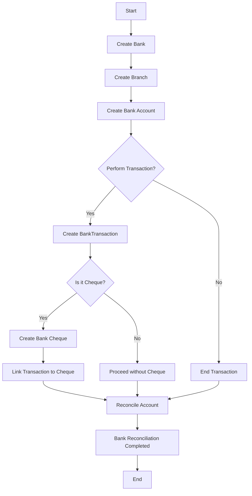

# Bank Module Action Flow Description

## 1. Create Bank

- **Purpose:** Set up a bank entity in the system.
- **Key Fields:** `name`, `short_name`, `swift_code`, `routing_number`, `status`
- **Outcome:** A bank is ready to have branches and accounts assigned.

---

## 2. Create Bank Branch

- **Purpose:** Define physical or operational branches under the bank.
- **Key Fields:** `bank_id`, `name`, `routing_number`, `address`
- **Outcome:** Branches represent locations or departments where accounts and transactions are managed.

---

## 3. Create Bank Account

- **Purpose:** Set up accounts for the bank or branch, which can hold deposits, withdrawals, and other financial activities.
- **Key Fields:** `bank_id`, `bank_branch_id`, `account_name`, `account_number`, `iban`, `currency`, `status`
- **Outcome:** Each account is ready to process transactions and track balances.

---

## 4. Perform Transactions

- **Purpose:** Record deposits, withdrawals, transfers, and cheque activities.
- **Transaction Types:** `DEPOSIT`, `WITHDRAW`, `TRANSFER`, `CHEQUE_DEPOSIT`, `CHEQUE_ISSUE`

**Flow:**

- If the transaction involves a cheque, it creates a **Bank Cheque** and links the transaction.
- Non-cheque transactions are directly recorded in the **BankTransaction** table.

- **Outcome:** The system updates the account balances (`balance_after`) and logs the transaction.

---

## 5. Bank Cheques

- **Purpose:** Handle cheques issued or received.
- **Key Fields:** `bank_account_id`, `cheque_no`, `type`, `amount`, `payee`, `cheque_date`, `status`
- **Statuses:** `PENDING`, `CLEARED`, `BOUNCED`, `CANCELLED`
- **Outcome:** Cheque status is tracked, and transactions are linked to the cheque for traceability.

---

## 6. Bank Reconciliation

- **Purpose:** Ensure that the system’s records match the bank statement.
- **Key Fields:** `bank_account_id`, `reconcile_date`, `statement_balance`, `system_balance`, `notes`
- **Outcome:** Any differences are noted, and the account is verified, ensuring accuracy and preventing discrepancies.

---

## 7. Audit & Accountability

- **Purpose:** Track who created or approved transactions, cheques, and reconciliations.
- **Key Fields:** `created_by`, `approved_by`
- **Outcome:** Provides a full audit trail for compliance and financial control.

---

## Summary

The **Bank Module Flow** ensures that:

- Banks and branches are properly set up.
- Accounts can perform various types of financial transactions.
- Cheques are accurately processed and tracked.
- Reconciliations validate balances, ensuring system integrity.
- Audit trails maintain accountability at all levels.

# Bank Module Action Flow

## Overview

This flow describes the lifecycle of bank operations including Banks, Branches, Accounts, Transactions, Cheques, and Reconciliation.

## Mermaid Flowchart

