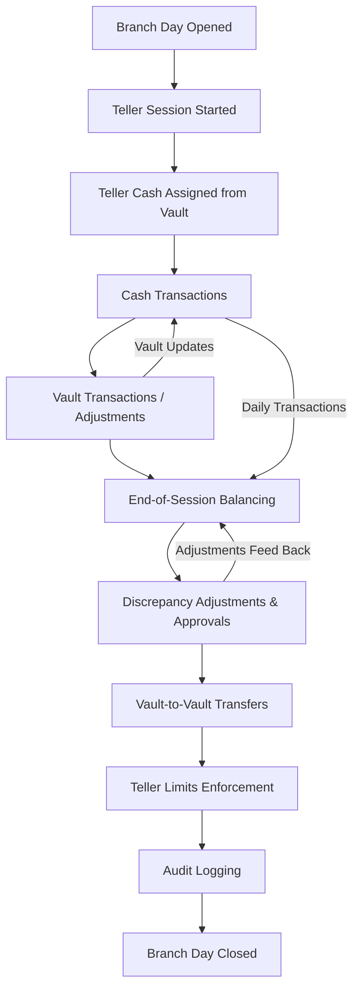

# Branch Cash Management Action Flow

This document outlines the step-by-step operational flow for branch, teller, vault, and cash drawer management.

---

## **Action Flow Steps**

1. **Branch Day Initialization**
    - Admin/Branch Manager opens the branch day.
    - `branch_days` record created:
        - `business_date`, `opened_at`, `opened_by`
        - `status = OPEN`
    - **Effect:** Tellers can start sessions.

2. **Teller Session Start**
    - Teller starts their session.
    - `teller_sessions` created:
        - `teller_id`, `branch_day_id`, `opening_cash`
        - `opened_at`, `status = OPEN`
    - Cash drawer assigned (`cash_drawers`).

3. **Vault Funding / Teller Cash Assignment**
    - Teller receives cash from vault:
        - `teller_vault_transfers` → type `CASH_TO_TELLER`
    - Teller returns cash to vault:
        - `teller_vault_transfers` → type `CASH_TO_VAULT`
    - Vault balances update accordingly.

4. **Cash Transactions**
    - Teller performs transactions:
        - `cash_transactions` → `CASH_IN` / `CASH_OUT`
        - Linked to source (deposit, withdrawal, payment)
    - Cash drawer balances update dynamically.

5. **Vault Transactions**
    - Any vault-level IN/OUT adjustments:
        - `vault_transactions` → `vault_id`, optional `teller_id`
    - Vault total balances updated.

6. **End-of-Session Balancing**
    - Teller closes session:
        - `teller_sessions.closed_at`, `status = CLOSED`
        - Cash drawer `closing_balance` recorded
    - `cash_balancings`:
        - Compare `expected_balance` vs `actual_balance`
        - Calculate `difference`
        - Verified by supervisor (`verified_by`)

7. **Adjustments & Approvals**
    - Any discrepancies corrected:
        - `cash_adjustments` → `SHORTAGE` / `EXCESS`
        - Reason and approval logged

8. **Vault-to-Vault Transfers**
    - Inter-vault cash movements:
        - `vault_transfers` → `from_vault_id`, `to_vault_id`
        - Optional approval and remarks

9. **Teller Limits Enforcement**
    - Checks against `teller_limits`:
        - `max_cash_limit`, `max_transaction_limit`
    - Prevents exceeding operational limits

10. **Audit Logging**
    - All cash operations logged:
        - `cash_audit_logs` → `cash_drawer_id`, `user_id`, `action`, `details`, `action_time`

11. **Branch Day Closure**
    - Branch manager closes the day:
        - `branch_days.closed_at`, `closed_by`
        - `status = CLOSED`
    - No further sessions allowed until next business day

---

## **Visual Action Flow Chart**

