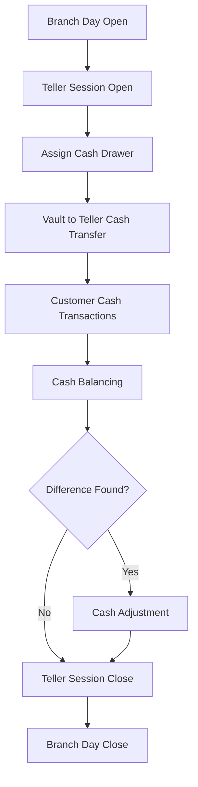

# Branch Cash Management – Action Flows

## Actors

The system involves the following actors:

- **Branch Manager**
- **Teller**
- **Vault Officer / Cash Officer**
- **Auditor / Supervisor**
- **System (Automated processes)**

---

# 1. Branch Day Opening

**Actor:** Branch Manager / Authorized Staff  
**Purpose:** Start daily financial operations for the branch.

## Flow

1. Actor selects **Open Branch Day**
2. System checks if the branch already has an open day
3. Actor enters:
    - `business_date`

4. System creates a record in `branch_days`
5. System sets:
    - `status = OPEN`
    - `opened_at = current timestamp`
    - `opened_by = actor`

## Affected Tables

| Table         | Operation |
| ------------- | --------- |
| `branch_days` | INSERT    |

## Result

Branch operations become available for the day.

---

# 2. Teller Session Opening

**Actor:** Teller  
**Purpose:** Teller starts their working session.

## Flow

1. Teller logs into the system
2. System verifies that `branch_day.status = OPEN`
3. Teller selects **Open Teller Session**
4. Teller enters:
    - `opening_cash`

5. System creates a new record in `teller_sessions`

## Affected Tables

| Table             | Operation |
| ----------------- | --------- |
| `users`           | READ      |
| `branch_days`     | READ      |
| `teller_sessions` | INSERT    |
| `cash_drawers`    | INSERT    |

## Result

Teller is authorized to perform cash journal_entries.

---

# 3. Assign Cash Drawer

**Actor:** Vault Officer / Manager  
**Purpose:** Assign working cash to the teller.

## Flow

1. Actor selects **Assign Cash Drawer**
2. Select:
    - `teller_session`
    - `vault`

3. Enter:
    - `opening_balance`

4. System creates a record in `cash_drawers`

## Affected Tables

| Table             | Operation |
| ----------------- | --------- |
| `teller_sessions` | READ      |
| `vaults`          | READ      |
| `cash_drawers`    | INSERT    |

## Result

Teller receives operational cash.

---

# 4. Vault → Teller Cash Transfer

**Actor:** Vault Officer  
**Purpose:** Provide additional cash to the teller.

## Flow

1. Actor selects **Vault to Teller Transfer**
2. Select:
    - `vault`
    - `teller_session`

3. Enter transfer `amount`
4. System records transfer

## Affected Tables

| Table                    | Operation |
| ------------------------ | --------- |
| `vaults`                 | UPDATE    |
| `cash_drawers`           | UPDATE    |
| `teller_vault_transfers` | INSERT    |
| `vault_transactions`     | INSERT    |
| `cash_audit_logs`        | INSERT    |

## System Actions

- Vault balance decreases
- Teller drawer balance increases

---

# 5. Teller → Vault Cash Return

**Actor:** Teller / Vault Officer  
**Purpose:** Return excess cash from teller drawer to vault.

## Flow

1. Teller selects **Return Cash to Vault**
2. Select target `vault`
3. Enter return `amount`
4. System records transfer

## Affected Tables

| Table                    | Operation |
| ------------------------ | --------- |
| `cash_drawers`           | UPDATE    |
| `vaults`                 | UPDATE    |
| `teller_vault_transfers` | INSERT    |
| `vault_transactions`     | INSERT    |
| `cash_audit_logs`        | INSERT    |

## System Actions

- Drawer balance decreases
- Vault balance increases

---

# 6. Teller Cash Transaction

**Actor:** Teller  
**Purpose:** Process customer cash journal_entries.

## Flow

1. Teller selects transaction type
2. Enter:
    - `amount`
    - `reference`

3. System validates teller limits
4. System records the transaction

## Affected Tables

| Table               | Operation |
| ------------------- | --------- |
| `cash_transactions` | INSERT    |
| `cash_drawers`      | UPDATE    |
| `cash_audit_logs`   | INSERT    |

## Transaction Types

- `CASH_IN`
- `CASH_OUT`

## Result

Drawer balance is updated automatically.

---

# 7. Teller Cash Balancing

**Actor:** Teller  
**Purpose:** Verify physical cash against system balance.

## Flow

1. Teller selects **Balance Cash**
2. System calculates:
    - `expected_balance`

3. Teller counts physical cash
4. Enter:
    - `actual_balance`

5. System calculates:
    - `difference`

## Affected Tables

| Table               | Operation |
| ------------------- | --------- |
| `cash_drawers`      | READ      |
| `cash_transactions` | READ      |
| `cash_balancings`   | INSERT    |
| `cash_audit_logs`   | INSERT    |

## Result

Cash variance recorded for reconciliation.

---

# 8. Cash Adjustment

**Actor:** Branch Manager / Supervisor  
**Purpose:** Resolve cash discrepancies.

## Flow

1. Supervisor reviews balancing report
2. Select adjustment type:
    - `shortage`
    - `excess`

3. Enter adjustment `reason`
4. Approve adjustment

## Affected Tables

| Table              | Operation |
| ------------------ | --------- |
| `cash_balancings`  | READ      |
| `cash_adjustments` | INSERT    |
| `cash_drawers`     | UPDATE    |
| `cash_audit_logs`  | INSERT    |

## Result

Cash discrepancy formally recorded and approved.

---

# 9. Teller Session Closing

**Actor:** Teller  
**Purpose:** End teller operational session.

## Flow

1. Teller selects **Close Session**
2. System verifies:
    - drawer balanced
    - no pending journal_entries

3. Teller enters:
    - `closing_cash`

4. System updates session status

## Affected Tables

| Table             | Operation |
| ----------------- | --------- |
| `teller_sessions` | UPDATE    |
| `cash_drawers`    | UPDATE    |
| `cash_audit_logs` | INSERT    |

## Result

Session status updated to `closed`.

---

# 10. Vault to Vault Transfer

**Actor:** Vault Officer / Manager  
**Purpose:** Move cash between vaults.

## Flow

1. Actor selects **Vault Transfer**
2. Select:
    - `from_vault`
    - `to_vault`

3. Enter transfer `amount`
4. Manager approves transfer

## Affected Tables

| Table                | Operation |
| -------------------- | --------- |
| `vault_transfers`    | INSERT    |
| `vault_transactions` | INSERT    |
| `vaults`             | UPDATE    |
| `cash_audit_logs`    | INSERT    |

## Result

Balances of both vaults updated.

---

# 11. Branch Day Closing

**Actor:** Branch Manager  
**Purpose:** Close branch financial operations for the day.

## Flow

1. Manager selects **Close Branch Day**
2. System verifies:
    - all teller sessions are closed
    - vault balances are verified

3. System updates `branch_days` record

## Affected Tables

| Table             | Operation |
| ----------------- | --------- |
| `teller_sessions` | READ      |
| `vaults`          | READ      |
| `branch_days`     | UPDATE    |
| `cash_audit_logs` | INSERT    |

## Result

Branch day status updated to `closed`.

---

# 12. Audit Logging

**Actor:** System  
**Purpose:** Track all critical financial operations.

## Logged Actions

- Cash transfers
- Teller session open / close
- Vault journal_entries
- Cash adjustments
- Cash balancing

## Affected Tables

| Table             | Operation |
| ----------------- | --------- |
| `cash_audit_logs` | INSERT    |

---

# System Flow Diagram

# Cash Transactions and Affected Tables

This document outlines all possible cash-related journal_entries in the system and the tables that are affected for each action. It also highlights how `cash_audit_logs` captures every activity for auditing purposes.

---

## 1. Branch Operations

### Opening a Branch Day

- **Action:** Open branch for the day.
- **Affected Tables:**
    - `branch_days` → status set to `OPEN`, `opened_at`, `opened_by`
    - `cash_audit_logs` → log `"BRANCH_OPENED"`

### Closing a Branch Day

- **Action:** Close branch at end of day.
- **Affected Tables:**
    - `branch_days` → status set to `closed`, `closed_at`, `closed_by`
    - `cash_audit_logs` → log `"BRANCH_CLOSED"`

---

## 2. Teller Operations

### Opening a Teller Session

- **Action:** Teller starts shift and receives opening cash.
- **Affected Tables:**
    - `teller_sessions` → `status = OPEN`, `opening_cash`, `opened_at`
    - `cash_drawers` → `opening_balance`
    - `cash_audit_logs` → `"TELLER_SESSION_OPENED"`

### Closing a Teller Session

- **Action:** Teller ends shift, reports closing cash.
- **Affected Tables:**
    - `teller_sessions` → `status = closed`, `closing_cash`, `closed_at`
    - `cash_drawers` → `closing_balance`
    - `cash_balancings` → record expected vs actual cash, difference
    - `cash_audit_logs` → `"TELLER_SESSION_CLOSED"`, `"CASH_BALANCED"`

---

## 3. Cash Transactions

### Cash In / Cash Out (from customers)

- **Action:** Teller receives or gives cash for deposits, withdrawals, or payments.
- **Affected Tables:**
    - `cash_transactions` → `amount`, `type` (`CASH_IN` / `CASH_OUT`), `source`, `reference`
    - `cash_drawers` → balance update
    - `vault_transactions` → if vault is involved
    - `cash_audit_logs` → log `"CASH_IN"` or `"CASH_OUT"` with details

### Vault Deposit / Withdrawal

- **Action:** Move cash between vault and teller.
- **Affected Tables:**
    - `vault_transactions` → `amount`, `type` (`IN` / `OUT`)
    - `cash_drawers` → balance update if moving to teller
    - `teller_vault_transfers` → log transfer
    - `cash_audit_logs` → `"CASH_TRANSFER_TO_TELLER"` / `"CASH_TRANSFER_TO_VAULT"`

### Vault-to-Vault Transfers

- **Action:** Moving cash between vaults, approved by a manager.
- **Affected Tables:**
    - `vault_transfers` → `from_vault_id`, `to_vault_id`, `amount`, `approved_by`
    - `vault_transactions` → two entries: `OUT` from source, `IN` to destination
    - `cash_audit_logs` → `"VAULT_TRANSFER"`

---

## 4. Cash Adjustments

### Handling Shortages or Excess

- **Action:** Adjust discrepancies after balancing.
- **Affected Tables:**
    - `cash_adjustments` → `amount`, `type` (`shortage` / `excess`), `reason`, `approved_by`
    - `cash_drawers` → balance update
    - `cash_audit_logs` → `"CASH_ADJUSTED"` with reason

### Balancing Cash Drawer

- **Action:** Verify cash in drawer against expected.
- **Affected Tables:**
    - `cash_balancings` → record `expected_balance`, `actual_balance`, `difference`, `verified_by`
    - `cash_drawers` → closing balance
    - `cash_audit_logs` → `"CASH_BALANCED"`

---

## 5. Denominations Handling

### Vault Denomination Update

- **Action:** Count or adjust notes in vault.
- **Affected Tables:**
    - `vault_denominations` → `count` update
    - `vault_transactions` → optional if adjustment involves movement
    - `cash_audit_logs` → `"DENOMINATION_COUNT_UPDATED"`

---

## 6. Miscellaneous / Reference Actions

- **Teller creation / activation / deactivation**
    - Tables: `tellers`, `cash_audit_logs` → `"TELLER_CREATED"`, `"TELLER_DEACTIVATED"`
- **Vault creation / activation / deactivation**
    - Tables: `vaults`, `cash_audit_logs` → `"VAULT_CREATED"`, `"VAULT_DEACTIVATED"`

---

## Summary Table

| Transaction Type        | Primary Tables                                                 | Audit Logs                                               |
| ----------------------- | -------------------------------------------------------------- | -------------------------------------------------------- |
| Open Branch Day         | `branch_days`                                                  | `"BRANCH_OPENED"`                                        |
| Close Branch Day        | `branch_days`                                                  | `"BRANCH_CLOSED"`                                        |
| Open Teller Session     | `teller_sessions`, `cash_drawers`                              | `"TELLER_SESSION_OPENED"`                                |
| Close Teller Session    | `teller_sessions`, `cash_drawers`, `cash_balancings`           | `"TELLER_SESSION_CLOSED"`                                |
| Cash In/Out             | `cash_transactions`, `cash_drawers`, `vault_transactions`      | `"CASH_IN"` / `"CASH_OUT"`                               |
| Teller-Vault Transfer   | `teller_vault_transfers`, `vault_transactions`, `cash_drawers` | `"CASH_TRANSFER_TO_TELLER"` / `"CASH_TRANSFER_TO_VAULT"` |
| Vault-to-Vault Transfer | `vault_transfers`, `vault_transactions`                        | `"VAULT_TRANSFER"`                                       |
| Cash Adjustment         | `cash_adjustments`, `cash_drawers`                             | `"CASH_ADJUSTED"`                                        |
| Cash Balancing          | `cash_balancings`, `cash_drawers`                              | `"CASH_BALANCED"`                                        |
| Denomination Count      | `vault_denominations`                                          | `"DENOMINATION_COUNT_UPDATED"`                           |
