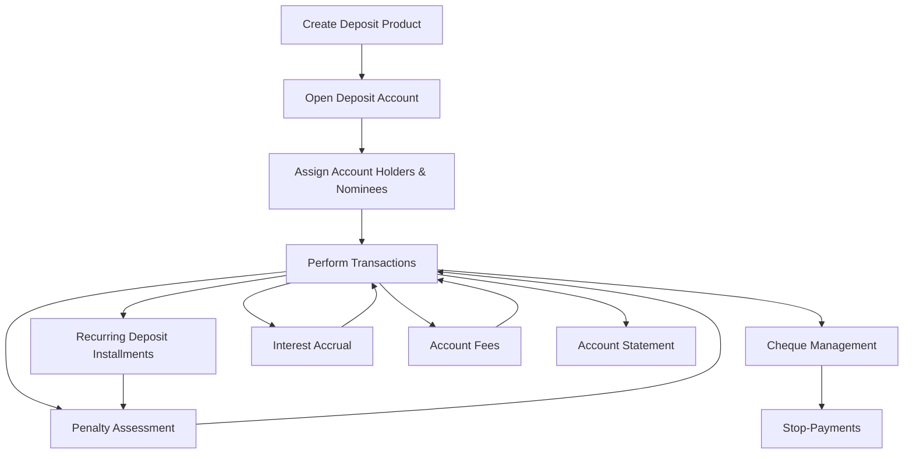

# Deposit Module Action Flow

The Deposit Module handles all deposit products (savings, recurring, term deposits, shares) and their associated accounts, journal_entries, cheques, interest accrual, penalties, and statements. Below is a step-by-step action flow.

---

## Action Flow Description

1. **Create Deposit Product**
    - **Purpose:** Define a new deposit product (e.g., Savings, Recurring, Term Deposit, Share account).
    - **Key Fields:** `code`, `name`, `type`, `subtype`, `interest_rate`, `minimum_balance`, `policies`.
    - **Outcome:** Product is available to be assigned to customer accounts.

2. **Open Deposit Account**
    - **Purpose:** Open an account for a customer using a deposit product.
    - **Key Fields:** `account_no`, `account_name`, `customer_id`, `deposit_product_id`, `branch_id`, `balance`, `status`.
    - **Outcome:** Account is ready for deposits, withdrawals, and journal_entries.

3. **Assign Account Holders and Nominees**
    - **Purpose:** Define account ownership and beneficiaries.
    - **Key Fields:** `holder_type`, `ownership_percent` for holders; `name`, `relation`, `allocation_percent` for nominees.
    - **Outcome:** Ownership and nominee structure is established.

4. **Deposit / Withdrawal / Transaction**
    - **Purpose:** Record account journal_entries such as deposits, withdrawals, transfers, interest, penalties, and cheque activities.
    - **Transaction Types:** `deposit`, `withdraw`, `transfer`, `interest`, `penalty`, `cheque_withdrawal`, `cheque_deposit`, `reversal`.
    - **Outcome:** Account balances are updated and transaction history is recorded.

5. **Recurring Deposit Installments**
    - **Purpose:** For recurring deposits, track installments due and paid.
    - **Key Fields:** `installment_no`, `due_date`, `amount_due`, `amount_paid`, `status`.
    - **Outcome:** Installments are monitored and penalties applied for missed payments.

6. **Cheque Management**
    - **Purpose:** Manage cheque books and individual cheques.
    - **Key Fields:** `cheque_book_id`, `cheque_number`, `amount`, `payee_name`, `status`.
    - **Cheque Statuses:** `unused`, `issued`, `presented`, `cleared`, `bounced`, `cancelled`.
    - **Outcome:** Cheque usage and stop-payments are tracked and linked to journal_entries.

7. **Interest Accrual**
    - **Purpose:** Calculate accrued interest for eligible accounts.
    - **Key Fields:** `accrual_date`, `accrued_interest`, `is_posted`.
    - **Outcome:** Interest is calculated and optionally posted as a transaction.

8. **Penalty Assessment**
    - **Purpose:** Apply penalties for premature withdrawal, overdue installments, or other rules.
    - **Key Fields:** `penalty_type`, `penalty_amount`, `is_posted`.
    - **Outcome:** Penalties are recorded and may generate journal_entries.

9. **Account Fees**
    - **Purpose:** Apply fees like opening, maintenance, or transaction charges.
    - **Key Fields:** `fee_type`, `amount`, `frequency`, `is_paid`.
    - **Outcome:** Fees are tracked and can be linked to journal_entries.

10. **Account Statement**
    - **Purpose:** Generate statement entries from all journal_entries.
    - **Key Fields:** `debit`, `credit`, `balance`, `posted_at`.
    - **Outcome:** Complete ledger for account with balances and journal_entries.

---

## Visual Flow Diagram

