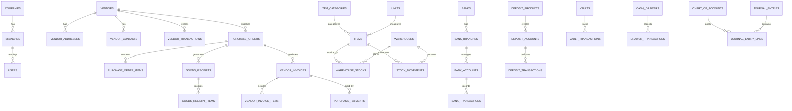

# ERP Database Architecture

This document describes the database relationships between the core modules of the financial ERP system.

The system is modular and designed to support financial operations, procurement, inventory management, banking operations, deposits, and accounting.

---

# Core Modules

## Organization Module

Handles the organizational hierarchy and system users.

Tables:

- companies
- branches
- users
- roles
- permissions

Purpose:

- Access control
- Branch management
- Operational structure

---

## Vendor Module

Manages suppliers and vendor-related financial records.

Tables:

- vendors
- vendor_addresses
- vendor_contacts
- vendor_categories
- vendor_transactions

Purpose:

- Supplier management
- Vendor financial tracking

---

## Purchase Module

Handles procurement and vendor purchasing.

Tables:

- purchase_orders
- purchase_order_items
- goods_receipts
- goods_receipt_items
- vendor_invoices
- vendor_invoice_items
- purchase_payments
- purchase_returns
- purchase_return_items

Purpose:

- Procurement lifecycle
- Vendor payment management

---

## Inventory Module

Tracks product inventory across warehouses.

Tables:

- items
- item_categories
- units
- warehouses
- warehouse_stocks
- stock_movements
- stock_transfers
- stock_adjustments

Purpose:

- Stock control
- Warehouse management

---

## Bank Module

Handles banking operations.

Tables:

- banks
- bank_branches
- bank_accounts
- bank_transactions
- bank_cheques
- bank_reconciliations

Purpose:

- Bank account tracking
- Payment processing
- Bank reconciliation

---

## Deposit Module

Manages customer deposit accounts.

Tables:

- deposit_products
- deposit_accounts
- deposit_transactions
- deposit_account_statements
- cheque_books
- cheques

Purpose:

- Savings management
- Interest calculation
- Deposit vouchers

---

## Vault / Cash Module

Manages internal physical cash operations.

Tables:

- vaults
- vault_transactions
- cash_drawers
- drawer_transactions
- cash_transfers

Purpose:

- Cash handling
- Branch teller operations

---

## Accounting Module

Records financial entries for reporting and auditing.

Tables:

- chart_of_accounts
- voucher_entries
- journal_entry_lines
- ledgers

Purpose:

- Financial reporting
- Double-entry accounting
- Audit compliance

---

# ERP Database Relationship Diagram

