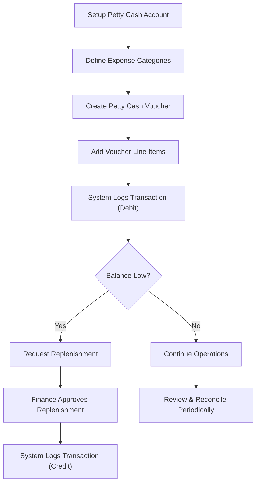

# Petty Cash Operational Flow

## Actors

- **Branch Staff / Petty Cash Custodian** – manages petty cash, creates vouchers.
- **Finance Manager / Approver** – approves replenishments.
- **System / Database** – maintains records, logs transactions automatically.

---

## 1. Petty Cash Account Setup

**Actor:** Branch Staff / System

**Actions:**

1. Create a petty cash account for the branch.
2. Assign a custodian (optional).
3. Set `imprest_amount` (fixed fund) and initial `current_balance`.
4. Activate account (`is_active = true`).

**System:** Stores account in `petty_cash_accounts`.

---

## 2. Define Expense Categories

**Actor:** Finance / Branch Staff

**Actions:**

1. Define expense categories (e.g., Office Supplies, Travel, Utilities).
2. Assign unique `code` and optional description.

**System:** Stores categories in `expense_categories`.

---

## 3. Voucher Creation

**Actor:** Petty Cash Custodian

**Actions:**

1. Create a petty cash voucher for a specific account.
2. Enter voucher details: `voucher_no`, `voucher_date`, `total_amount`, `remarks`.
3. Add voucher line items:
    - Select `expense_category`.
    - Enter `amount`, optional `description` and `receipt_no`.

**System:**

- Saves voucher in `petty_cash_vouchers`.
- Saves line items in `petty_cash_voucher_items`.
- Updates `petty_cash_transactions` (debit) and `current_balance`.

---

## 4. Replenishment / Top-up

**Actor:** Branch Staff / Finance Manager

**Actions:**

1. Custodian requests replenishment when petty cash is low.
2. Enter `replenish_no`, `source_account`, `amount`, `replenish_date`, `remarks`.
3. Finance Manager approves (optional).

**System:**

- Records in `petty_cash_replenishments`.
- Updates `petty_cash_transactions` (credit) and `current_balance`.

---

## 5. Transaction Logging

**Actor:** System

**Actions:**

1. On every voucher or replenishment, log transaction in `petty_cash_transactions`.
2. Track `debit`, `credit`, `balance`, `transaction_date`.
3. Polymorphic `reference` links to voucher, replenishment, or adjustments.

---

## 6. Daily / Periodic Operations

**Actor:** Branch Staff / Finance

**Actions:**

1. Review petty cash balance and transactions.
2. Ensure vouchers match replenishments.
3. Close or reconcile petty cash accounts periodically.

---

## Visual Action Flow

