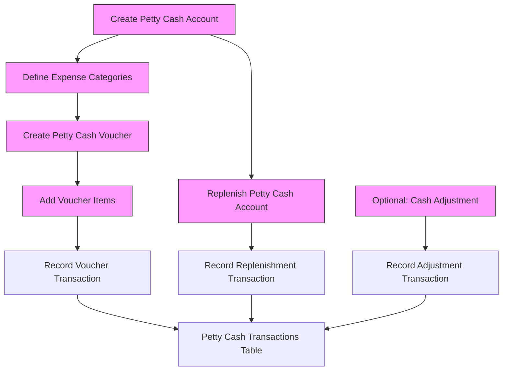

# Petty Cash Module Documentation

### Step-by-Step Actions

1. **Petty Cash Account Setup**
    - Create account per branch.
    - Table: `petty_cash_accounts`
    - Key Fields: `name`, `code`, `branch_id`, `custodian_id`, `imprest_amount`, `current_balance`

2. **Define Expense Categories**
    - Table: `expense_categories`
    - Key Fields: `name`, `code`, `description`

3. **Voucher Creation**
    - Table: `petty_cash_vouchers`
    - Key Fields: `voucher_no`, `petty_cash_account_id`, `voucher_date`, `total_amount`, `created_by`
    - Sub-action: Add voucher items (`petty_cash_voucher_items`)
        - Fields: `petty_cash_voucher_id`, `expense_category_id`, `amount`, `description`, `receipt_no`

4. **Replenishment / Top-up**
    - Table: `petty_cash_replenishments`
    - Fields: `replenish_no`, `petty_cash_account_id`, `source_account`, `amount`, `replenish_date`, `approved_by`

5. **Transaction Logging**
    - Table: `petty_cash_transactions`
    - All vouchers, replenishments, and adjustments are logged here.
    - Fields: `petty_cash_account_id`, `reference_type`, `reference_id`, `debit`, `credit`, `balance`, `transaction_date`

6. **Optional Adjustments**
    - Record shortages/excesses manually.
    - Logged as `reference_type = adjustment` in `petty_cash_transactions`.

---

## 3. Visual Flowchart

