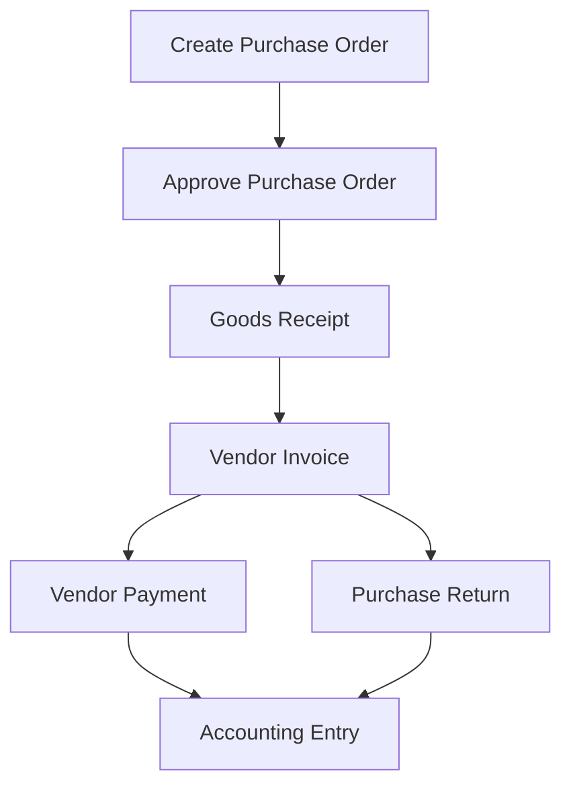
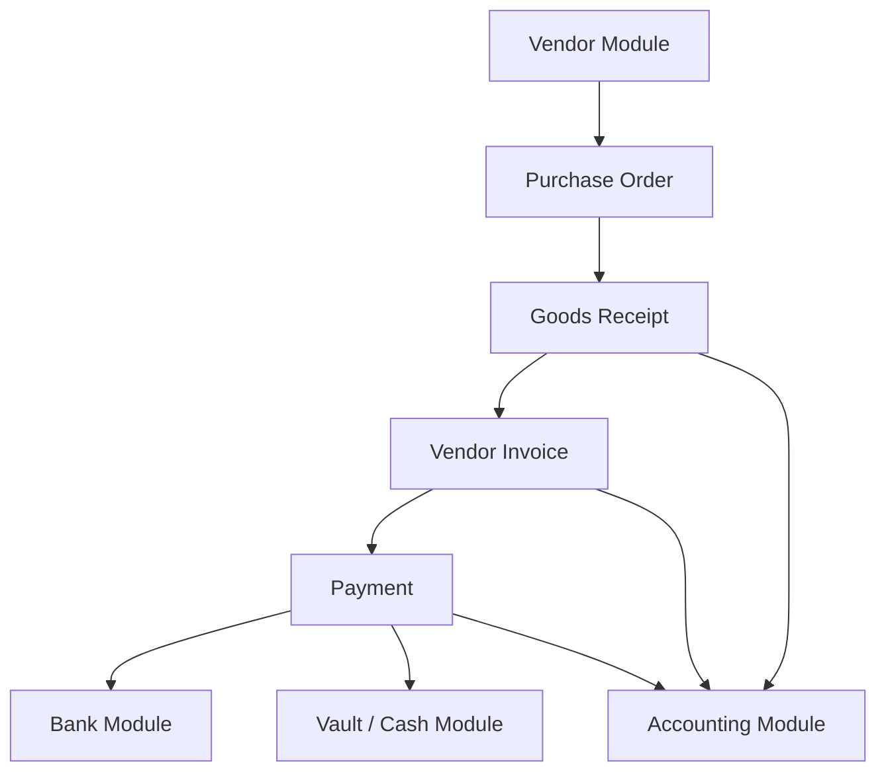

# Purchase Module Action Flow

The Purchase Module manages procurement from vendors including purchase orders, goods receipts, vendor invoices, payments, and returns.

This module integrates with:

- Vendor Module
- Inventory Module
- Bank Module
- Vault / Cash Module
- Accounting Module

---

# 1. Create Purchase Order

A purchase order (PO) is created to request goods or services from a vendor.

### Steps

1. User selects **Vendor**
2. Add purchase items
3. Enter quantity and price
4. System calculates totals
5. Save PO as **Draft**

### Status

- DRAFT
- APPROVED
- PARTIALLY_RECEIVED
- RECEIVED
- CANCELLED

---

# 2. Approve Purchase Order

Before procurement begins, the purchase order must be approved.

### Steps

1. Manager reviews PO
2. Verify vendor and pricing
3. Approve order

### Result

PO becomes **APPROVED** and vendor can deliver goods.

---

# 3. Goods Receipt (GRN)

When goods arrive, they are recorded through a **Goods Receipt Note**.

### Steps

1. Select Purchase Order
2. Enter received items
3. Record quantities received
4. Save Goods Receipt

### Result

Inventory and purchase tracking updated.

---

# 4. Vendor Invoice

The vendor sends an invoice for the delivered goods.

### Steps

1. Create Vendor Invoice
2. Link with Purchase Order
3. Enter invoice amount
4. Verify totals

### Status

- PENDING
- PARTIALLY_PAID
- PAID
- CANCELLED

---

# 5. Payment Processing

Payments to vendors can be made through different channels.

### Payment Methods

- Bank Transfer
- Cash (Vault / Petty Cash)
- Cheque

### Steps

1. Select Vendor Invoice
2. Enter payment amount
3. Choose payment method
4. Record payment

### Result

Vendor balance updated.

---

# 6. Accounting Entry

Every purchase transaction generates accounting records.

### Example Entries

Purchase Invoice:

Debit → Purchase Expense / Inventory  
Credit → Vendor Payable

Vendor Payment:

Debit → Vendor Payable  
Credit → Bank / Cash

---

# 7. Purchase Return

If goods are damaged or incorrect, a purchase return can be created.

### Steps

1. Select Vendor Invoice
2. Select returned items
3. Enter return quantity
4. Record reason

### Result

Vendor credit or refund generated.

---

# Purchase Workflow Diagram

### Integrated System Flow

### Purchase Lifecycle Summary

- Vendor Selected
- Purchase Order Created
- Purchase Order Approved
- Goods Received
- Vendor Invoice Recorded
- Payment Processed
- Accounting Entries Generated
- Purchase Return (if required)
