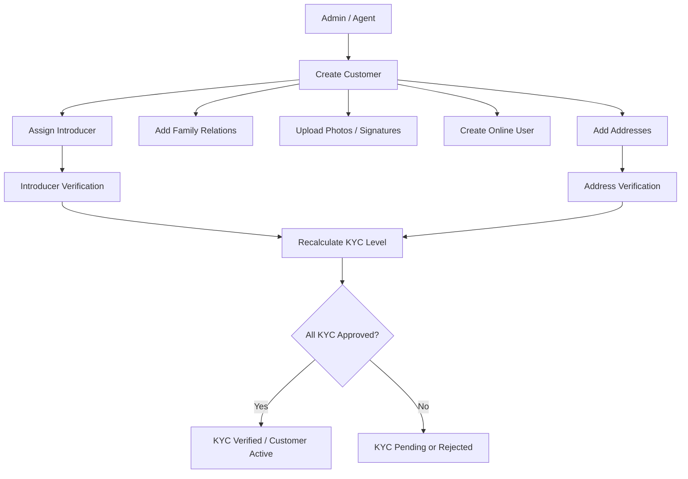

# Customer Onboarding & KYC Working Flow

This document defines the complete customer onboarding and KYC lifecycle, including creation, verification stages, audit tracking, and compliance rules.

---

## 1. Customer Creation

### Description

An Admin or Agent creates a new customer profile.

### Rules

- Customer type:
    - Individual
    - Organization
- If customer type is Organization, identification type must be `REGISTRATION_NO`.
- Customer is not KYC-verified at creation.

### Data Collected

- Name
- Phone (optional)
- Email (optional)
- Date of birth (optional)
- Gender (optional)
- Religion (optional)
- Identification type
- Identification number
- Customer photo (optional)

### Default System Values

- `status = PENDING`
- `kyc_level = MIN`
- `kyc_status = PENDING`
- `created_by = current user`

---

## 2. Customer Addresses

### Description

Admin adds one or more addresses for the customer.

### Address Rules

- A customer may have multiple addresses.
- A customer may have only one address per address type.
- Address type uniqueness is enforced at database level.

### Address Types

- CURRENT
- PERMANENT
- MAILING
- WORK
- REGISTERED
- OTHER

### Address Fields

- Line 1
- Line 2 (optional)
- Division
- District
- Upazila
- Union / Ward
- Postal code
- Country

### Verification

- `verification_status`: PENDING | VERIFIED | REJECTED
- `verified_by`
- `verified_at`

### KYC Impact

- Permanent address must be VERIFIED to qualify for ENH KYC.

---

## 3. Customer Family Relations

### Description

Admin may add family members or relatives.

### Relation Types

Examples include:

- FATHER, MOTHER
- SON, DAUGHTER
- BROTHER, SISTER
- HUSBAND, WIFE
- IN-LAWS, COUSINS

### Relation Modes

- Linked customer (`relative_id`)
- Raw identity information (name, identification, contact)

> Either `relative_id` or raw identity information must be provided.

### Constraints

- Duplicate relations between the same customer and relative are not allowed.

---

## 4. Customer Photos

### Description

Stores customer photo records.

### Fields

- File name
- File path
- MIME type
- Alt text (optional)

### Notes

- Multiple photos may exist for history and audit purposes.

---

## 5. Customer Signatures

### Description

Stores customer signature records.

### Fields

- File name
- Signature path
- MIME type
- Alt text (optional)

---

## 6. Online Service User (Optional)

### Description

Creates online access credentials for the customer.

### Rules

- One online user per customer.
- Creation allowed after MIN KYC.

### Fields

- Username (unique)
- Email (unique, optional)
- Phone (unique, optional)
- Password (hashed)
- Last login timestamp
- Status: ACTIVE | SUSPENDED | CLOSED

---

## 7. Introducer Assignment (Optional)

### Description

An existing customer introduces another customer.

### Relationships

- Introduced customer
- Introducer customer
- Introducer deposit account

### Relationship Types

- FAMILY
- FRIEND
- BUSINESS
- COLLEAGUE
- OTHER

### Constraints

- One introducer per customer.

### Verification

- `verification_status`: PENDING | VERIFIED | REJECTED
- `verified_by`
- `verified_at`

### KYC Impact

- Verified introducer is required for STD KYC.

---

## 8. KYC Status and Level Evaluation

### KYC Levels

KYC levels are system-calculated.

| Level | Requirements                     |
| ----- | -------------------------------- |
| MIN   | Identity and religion            |
| STD   | MIN + verified introducer        |
| ENH   | STD + verified permanent address |

### KYC Status Values

- PENDING
- VERIFIED
- REJECTED

---

## 9. Customer Activation

### Activation Rules

When all required KYC checks pass:

- `kyc_status = VERIFIED`
- `status = ACTIVE`
- `kyc_verified_by`
- `kyc_verified_at`

If verification fails:

- `kyc_status = REJECTED`
- `status = PENDING or SUSPENDED`

---

## 10. Audit Trail

### Audit Fields

All tables must include:

- `created_by`
- `updated_by`

Verification-sensitive tables additionally include:

- `verified_by`
- `verified_at`

---

## 11. Workflow Diagram



```php
<?php

use Illuminate\Database\Migrations\Migration;
use Illuminate\Database\Schema\Blueprint;
use Illuminate\Support\Facades\Schema;

return new class extends Migration {

    public function up(): void
    {
        /*
        |--------------------------------------------------------------------------
        | Customers
        |--------------------------------------------------------------------------
        */
        Schema::create('customers', function (Blueprint $table) {
            $table->id();

            $table->string('customer_no', 50)->unique()->comment('Unique customer number');
            $table->enum('type', ['Individual', 'Organization'])->comment('Customer type');
            $table->string('name', 150);
            $table->string('phone', 50)->nullable();
            $table->string('email', 100)->nullable();
            $table->date('dob')->nullable();

            $table->enum('gender', ['MALE', 'FEMALE', 'OTHER'])->nullable();
            $table->enum('religion', ['CHRISTIANITY', 'ISLAM', 'HINDUISM', 'BUDDHISM', 'OTHER'])->nullable();

            $table->enum('identification_type', [
                'NID',
                'BRN',
                'REGISTRATION_NO',
                'PASSPORT',
                'DRIVING_LICENSE'
            ]);

            $table->string('identification_number', 50);

            // KYC
            $table->enum('kyc_level', ['MIN', 'STD', 'ENH'])->default('MIN');
            $table->enum('kyc_status', ['PENDING', 'VERIFIED', 'REJECTED'])->default('PENDING');

            $table->foreignId('kyc_verified_by')->nullable()->constrained('users')->nullOnDelete();
            $table->timestamp('kyc_verified_at')->nullable();

            $table->enum('status', ['PENDING', 'ACTIVE', 'SUSPENDED', 'CLOSED'])->default('PENDING');

            // Audit
            $table->foreignId('created_by')->nullable()->constrained('users')->nullOnDelete();
            $table->foreignId('updated_by')->nullable()->constrained('users')->nullOnDelete();

            $table->timestamps();
        });

        /*
        |--------------------------------------------------------------------------
        | Customer Addresses
        |--------------------------------------------------------------------------
        */
        Schema::create('customer_addresses', function (Blueprint $table) {
            $table->id();

            $table->foreignId('customer_id')
                ->constrained('customers')
                ->cascadeOnDelete();

            $table->string('line1', 255);
            $table->string('line2', 255)->nullable();
            $table->string('division', 100)->nullable();
            $table->string('district', 100)->nullable();
            $table->string('upazila', 100)->nullable();
            $table->string('union_ward', 100)->nullable();
            $table->string('postal_code', 20)->nullable();
            $table->string('country', 150)->default('Bangladesh');

            $table->enum('type', [
                'CURRENT',
                'PERMANENT',
                'MAILING',
                'WORK',
                'REGISTERED',
                'OTHER'
            ]);

            // Verification
            $table->enum('verification_status', ['PENDING', 'VERIFIED', 'REJECTED'])->default('PENDING');
            $table->foreignId('verified_by')->nullable()->constrained('users')->nullOnDelete();
            $table->timestamp('verified_at')->nullable();
            $table->text('remarks')->nullable();

            // Audit
            $table->foreignId('created_by')->nullable()->constrained('users')->nullOnDelete();
            $table->foreignId('updated_by')->nullable()->constrained('users')->nullOnDelete();

            $table->timestamps();

            // One address per type per customer
            $table->unique(['customer_id', 'type'], 'uq_customer_address_type');
        });

        /*
        |--------------------------------------------------------------------------
        | Customer Family Relations
        |--------------------------------------------------------------------------
        */
        Schema::create('customer_family_relations', function (Blueprint $table) {
            $table->id();

            $table->foreignId('customer_id')
                ->constrained('customers')
                ->cascadeOnDelete();

            $table->foreignId('relative_id')
                ->nullable()
                ->constrained('customers')
                ->nullOnDelete();

            // Raw identity (used when relative_id is null)
            $table->string('name', 150);
            $table->string('phone', 50)->nullable();
            $table->string('email', 100)->nullable();
            $table->date('dob')->nullable();

            $table->enum('gender', ['MALE', 'FEMALE', 'OTHER'])->nullable();
            $table->enum('religion', ['CHRISTIANITY', 'ISLAM', 'HINDUISM', 'BUDDHISM', 'OTHER'])->nullable();

            $table->enum('identification_type', [
                'NID',
                'BRN',
                'PASSPORT',
                'DRIVING_LICENSE'
            ]);

            $table->string('identification_number', 50);
            $table->string('photo', 255)->nullable();

            $table->enum('relation_type', [
                'FATHER',
                'MOTHER',
                'SON',
                'DAUGHTER',
                'BROTHER',
                'SISTER',
                'HUSBAND',
                'WIFE',
                'GRANDFATHER',
                'GRANDMOTHER',
                'UNCLE',
                'AUNT',
                'NEPHEW',
                'NIECE',
                'FATHER_IN_LAW',
                'MOTHER_IN_LAW',
                'SON_IN_LAW',
                'DAUGHTER_IN_LAW',
                'BROTHER_IN_LAW',
                'SISTER_IN_LAW'
            ]);

            // Prevent duplicate linkage
            $table->unique(['customer_id', 'relative_id'], 'uq_customer_relative');

            // Audit
            $table->foreignId('created_by')->nullable()->constrained('users')->nullOnDelete();
            $table->foreignId('updated_by')->nullable()->constrained('users')->nullOnDelete();

            $table->timestamps();
        });

        /*
        |--------------------------------------------------------------------------
        | Customer Photos
        |--------------------------------------------------------------------------
        */
        Schema::create('customer_photos', function (Blueprint $table) {
            $table->id();

            $table->foreignId('customer_id')
                ->unique()
                ->constrained('customers')
                ->cascadeOnDelete();

            $table->string('file_name');
            $table->string('file_path');
            $table->string('mime');
            $table->string('alt_text')->nullable();

            // Audit
            $table->foreignId('created_by')->nullable()->constrained('users')->nullOnDelete();
            $table->foreignId('updated_by')->nullable()->constrained('users')->nullOnDelete();

            $table->timestamps();
        });

        /*
        |--------------------------------------------------------------------------
        | Customer Signatures
        |--------------------------------------------------------------------------
        */
        Schema::create('customer_signatures', function (Blueprint $table) {
            $table->id();

            $table->foreignId('customer_id')
                ->unique()
                ->constrained('customers')
                ->cascadeOnDelete();

            $table->string('file_name');
            $table->string('file_path');
            $table->string('mime');
            $table->string('alt_text')->nullable();

            // Audit
            $table->foreignId('created_by')->nullable()->constrained('users')->nullOnDelete();
            $table->foreignId('updated_by')->nullable()->constrained('users')->nullOnDelete();

            $table->timestamps();
        });

        /*
        |--------------------------------------------------------------------------
        | Customer Introducers
        |--------------------------------------------------------------------------
        */
        Schema::create('customer_introducers', function (Blueprint $table) {
            $table->id();

            $table->foreignId('introduced_customer_id')
                ->constrained('customers')
                ->cascadeOnDelete();

            $table->foreignId('introducer_customer_id')
                ->constrained('customers');

            $table->foreignId('introducer_account_id')->nullable();

            $table->enum('relationship_type', [
                'FAMILY',
                'FRIEND',
                'BUSINESS',
                'COLLEAGUE',
                'OTHER'
            ])->default('OTHER');

            // Verification
            $table->enum('verification_status', ['PENDING', 'VERIFIED', 'REJECTED'])->default('PENDING');
            $table->foreignId('verified_by')->nullable()->constrained('users')->nullOnDelete();
            $table->timestamp('verified_at')->nullable();
            $table->text('remarks')->nullable();

            // Prevent duplicate introducers
            $table->unique(
                ['introduced_customer_id', 'introducer_customer_id'],
                'uq_customer_introducer'
            );

            // Audit
            $table->foreignId('created_by')->nullable()->constrained('users')->nullOnDelete();
            $table->foreignId('updated_by')->nullable()->constrained('users')->nullOnDelete();

            $table->timestamps();
        });

        /*
        |--------------------------------------------------------------------------
        | Online Service Users
        |--------------------------------------------------------------------------
        */
        Schema::create('online_service_users', function (Blueprint $table) {
            $table->id();

            $table->foreignId('customer_id')
                ->unique()
                ->constrained('customers')
                ->cascadeOnDelete();

            $table->string('username', 100)->unique();
            $table->string('email', 150)->unique()->nullable();
            $table->string('phone', 20)->unique()->nullable();
            $table->string('password', 255);

            $table->timestamp('last_login_at')->nullable();
            $table->enum('status', ['ACTIVE', 'SUSPENDED', 'CLOSED'])->default('ACTIVE');

            // Audit
            $table->foreignId('created_by')->nullable()->constrained('users')->nullOnDelete();
            $table->foreignId('updated_by')->nullable()->constrained('users')->nullOnDelete();

            $table->timestamps();
        });
    }

    public function down(): void
    {
        Schema::dropIfExists('online_service_users');
        Schema::dropIfExists('customer_introducers');
        Schema::dropIfExists('customer_signatures');
        Schema::dropIfExists('customer_photos');
        Schema::dropIfExists('customer_family_relations');
        Schema::dropIfExists('customer_addresses');
        Schema::dropIfExists('customers');
    }
};
```
