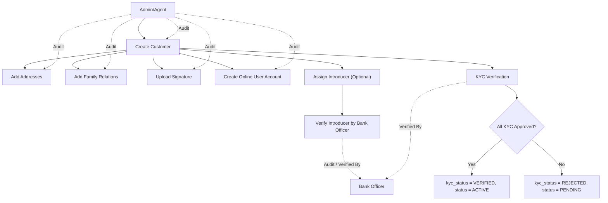

# Customer Onboarding & KYC Working Flow

---

## 1️⃣ Customer Creation

- Admin/agent creates a new Customer.
- Customer type: **Individual** or **Organization**.
- If Organization, **identification type = REGISTRATION_NO**.
- Fill in:
    - **Personal info:** name, phone, email, DOB, gender, religion.
    - **Identification info:** type + number.
    - **Optional:** photo.
- Save **created_by = current user**.
- Customer **status = PENDING**, **kyc_status = PENDING**.

---

## 2️⃣ Customer Addresses

- Admin adds Customer Addresses (can be multiple).
- Address types: **CURRENT**, **PERMANENT**, **MAILING**, **WORK**, etc.
- Include:
    - Division, district, upazila, postal code, union/ward, village/locality, country.
- Save **created_by**.

---

## 3️⃣ Customer Family Relations

- Admin can add family members / relatives.
- Each relative can be:
    - Another customer (`relative_id`)
    - Raw info (name, phone, email, etc.)
- Store **relation_type** and **reverse_relation_type**.
- Save **created_by**.

---

## 4️⃣ Customer Signatures

- Upload signature image.
- Store:
    - `file_name`, `signature_path`, `mime`
- Save **created_by**.

---

## 5️⃣ Online Users (Optional)

- Create online login credentials for the customer.
- Fields: `username`, `email`, `phone`, `password`.
- Save **created_by**.

---

## 6️⃣ Introducer Verification (Optional)

- If an introducer exists:
    - Link **introducer customer**, **introduced customer**, and **deposit account**.
    - Specify **relationship_type:** FAMILY, FRIEND, BUSINESS, COLLEAGUE, OTHER.
- Verification by bank officer:
    - `verification_status: PENDING → VERIFIED / REJECTED`
    - Save **verified_by** and **verified_at**.

---

## 7️⃣ KYC Verification

- Each KYC type:
    - NID, BRN, REG_NO, PASSPORT, DRIVING_LICENSE, INTRODUCER
- Status: `PENDING → APPROVED / REJECTED`
- Verified by bank officer:
    - Save **verified_by** and **verified_at**.

---

## 8️⃣ Status Update

- After KYC completion:
    - If all required KYC approved → `kyc_status = VERIFIED`
    - Customer status → **ACTIVE**
- Any rejection → `kyc_status = REJECTED`
    - Customer cannot perform transactions.

---

## 9️⃣ Audit Trail

- Every table includes:
    - `created_by` – who created the record
    - `updated_by` – who last updated
    - `kyc_verified_by` – who verified the KYC (for customer)



```php
<?php
use Illuminate\Database\Migrations\Migration;
use Illuminate\Database\Schema\Blueprint;
use Illuminate\Support\Facades\Schema;

return new class extends Migration {
    public function up(): void
    {
        Schema::create('customers', function (Blueprint $table) {
            $table->id();
            $table->string('customer_no', 50)->unique()->comment('Unique customer number');
            $table->enum('type', ['Individual', 'Organization'])->comment('Customer type');
            $table->string('name', 150);
            $table->string('phone', 50)->nullable();
            $table->string('email', 100)->nullable();
            $table->date('dob')->nullable();
            $table->enum('gender', ['MALE', 'FEMALE', 'OTHER'])->nullable();
            $table->enum('religion', ['CHRISTIANITY', 'ISLAM', 'HINDUISM', 'BUDDHISM', 'OTHER'])->nullable();
            $table->enum('identification_type', ['NID', 'BRN', 'REGISTRATION_NO', 'PASSPORT', 'DRIVING_LICENSE']);
            $table->string('identification_number', 50);
            $table->string('photo', 255)->nullable();
            $table->enum('kyc_status', ['PENDING', 'VERIFIED', 'REJECTED'])->default('PENDING');
            $table->enum('status', ['PENDING', 'ACTIVE', 'SUSPENDED', 'CLOSED'])->default('ACTIVE');
            $table->foreignId('created_by')->nullable()->constrained('users')->nullOnDelete();
            $table->foreignId('updated_by')->nullable()->constrained('users')->nullOnDelete();
            $table->timestamps();
        });

        Schema::create('customer_addresses', function (Blueprint $table) {
            $table->id();
            $table->foreignId('customer_id')->constrained()->cascadeOnDelete();
            $table->string('line1', 255);
            $table->string('line2', 255)->nullable();
            $table->string('division', 100);
            $table->string('district', 100);
            $table->string('upazila', 100)->nullable();
            $table->string('union_ward', 100)->nullable();
            $table->string('village_locality', 150)->nullable();
            $table->string('postal_code', 20)->nullable();
            $table->char('country_code', 2)->default('BD');
            $table->enum('type', ['CURRENT', 'PERMANENT', 'MAILING', 'WORK', 'REGISTERED', 'OTHER'])->default('CURRENT');
            $table->foreignId('created_by')->nullable()->constrained('users')->nullOnDelete();
            $table->foreignId('updated_by')->nullable()->constrained('users')->nullOnDelete();
            $table->timestamps();
        });

        Schema::create('customer_family_relations', function (Blueprint $table) {
            $table->id();
            $table->foreignId('customer_id')->constrained('customers')->cascadeOnDelete();
            $table->foreignId('relative_id')->nullable();
            $table->string('name', 150);
            $table->string('phone', 50)->nullable();
            $table->string('email', 100)->nullable();
            $table->date('dob')->nullable();
            $table->enum('gender', ['MALE', 'FEMALE', 'OTHER'])->nullable();
            $table->enum('religion', ['CHRISTIANITY', 'ISLAM', 'HINDUISM', 'BUDDHISM', 'OTHER'])->nullable();
            $table->enum('identification_type', ['NID', 'BRN', 'PASSPORT', 'DRIVING_LICENSE']);
            $table->string('identification_number', 50);
            $table->string('photo', 255)->nullable();
            $relations = [
                'FATHER','MOTHER','SON','DAUGHTER','BROTHER','COUSIN_BROTHER','COUSIN_SISTER','SISTER','HUSBAND','WIFE',
                'GRANDFATHER','GRANDMOTHER','GRANDSON','GRANDDAUGHTER','UNCLE','AUNT','NEPHEW','NIECE',
                'FATHER-IN-LAW','MOTHER-IN-LAW','SON-IN-LAW','DAUGHTER-IN-LAW','BROTHER-IN-LAW','SISTER-IN-LAW'
            ];
            $table->enum('relation_type', $relations);
            $table->enum('reverse_relation_type', $relations);
            $table->timestamps();
            $table->unique(['customer_id', 'relative_id'], 'uq_customer_relative');
            $table->index('relative_id');
            $table->index('relation_type');
            $table->foreignId('created_by')->nullable()->constrained('users')->nullOnDelete();
            $table->foreignId('updated_by')->nullable()->constrained('users')->nullOnDelete();
            $table->timestamps();
        });

        Schema::create('customer_signatures', function (Blueprint $table) {
            $table->id();
            $table->foreignId('customer_id')->constrained('customers')->cascadeOnDelete();
             $table->string('file_name');
            $table->string('signature_path');
            $table->string('mime');
            $table->string('alt_text')->nullable();
            $table->foreignId('created_by')->nullable()->constrained('users')->nullOnDelete();
            $table->foreignId('updated_by')->nullable()->constrained('users')->nullOnDelete();
            $table->timestamps();
        });

        Schema::create('customer_introducers', function (Blueprint $table) {
            $table->id();
            $table->foreignId('introduced_customer_id')->constrained('customers')->cascadeOnDelete();
            $table->foreignId('introducer_customer_id')->constrained('customers');
            $table->foreignId('introducer_account_id')->constrained('deposit_accounts');
            $table->enum('relationship_type', [ 'FAMILY', 'FRIEND', 'BUSINESS', 'COLLEAGUE', 'OTHER'])->default('OTHER');
            $table->enum('verification_status', ['PENDING', 'VERIFIED', 'REJECTED'])->default('PENDING');
            $table->foreignId('verified_by')->nullable()->constrained('users'); // bank officer
            $table->timestamp('verified_at')->nullable();
            $table->text('remarks')->nullable();
            $table->foreignId('created_by')->nullable()->constrained('users')->nullOnDelete();
            $table->foreignId('updated_by')->nullable()->constrained('users')->nullOnDelete();
            $table->timestamps();
        });

        Schema::create('kyc_verifications', function (Blueprint $table) {
            $table->id();
            $table->foreignId('customer_id')->constrained('customers')->cascadeOnDelete();
            $table->enum('verification_type', ['INTRODUCER', 'NID', 'BRN', 'REGISTRATION_NO', 'PASSPORT', 'DRIVING_LICENSE']);
            $table->enum('status', ['PENDING', 'APPROVED', 'REJECTED']);
            $table->foreignId('verified_by')->nullable()->constrained('users');
            $table->timestamp('verified_at')->nullable();
            $table->timestamps();
        });

        Schema::create('online_service_users', function (Blueprint $table) {
            $table->id();
            $table->foreignId('customer_id')->unique()->constrained('customers')->cascadeOnDelete();
            $table->string('username', 100)->unique();
            $table->string('email', 150)->unique()->nullable();
            $table->string('phone', 20)->unique()->nullable();
            $table->string('password', 255);
            $table->timestamp('last_login_at')->nullable();
            $table->enum('status', ['ACTIVE', 'SUSPENDED', 'CLOSED'])->default('ACTIVE');
            $table->foreignId('created_by')->nullable()->constrained('users')->nullOnDelete();
            $table->foreignId('updated_by')->nullable()->constrained('users')->nullOnDelete();
            $table->timestamps();
        });
    }

    public function down(): void
    {
        Schema::dropIfExists('customers');
        Schema::dropIfExists('customer_addresses');
        Schema::dropIfExists('customer_family_relations');
        Schema::dropIfExists('customer_signatures');
        Schema::dropIfExists('customer_introducers');
        Schema::dropIfExists('kyc_verifications');
        Schema::dropIfExists('online_service_users');
    }
};
```
