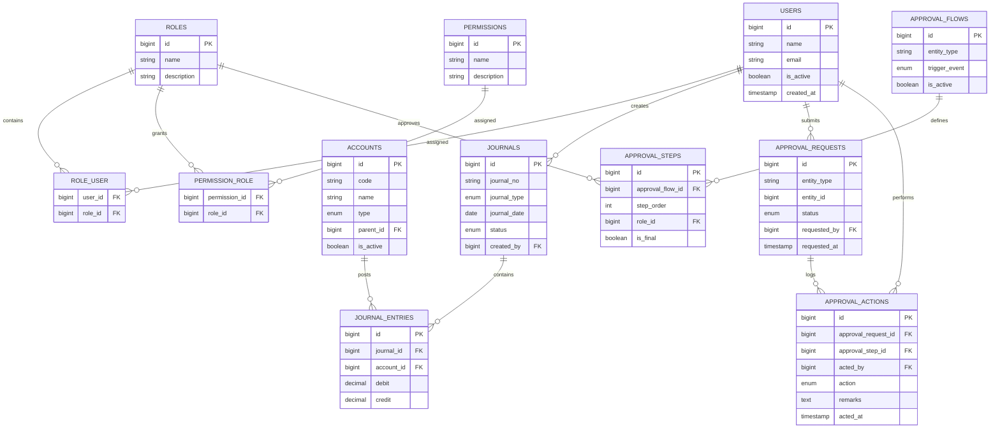

```php
use Illuminate\Database\Migrations\Migration;
use Illuminate\Database\Schema\Blueprint;
use Illuminate\Support\Facades\Schema;

return new class extends Migration
{
    public function up(): void
    {
        Schema::create('accounts', function (Blueprint $table) {
            $table->id();
            $table->string('code', 50)->unique()->comment('Unique GL code');
            $table->string('name', 100)->comment('Account name');
            $table->enum('type', ['ASSET', 'LIABILITY', 'EQUITY', 'INCOME', 'EXPENSE']);
            $table->boolean('is_control_account')->default(false);
            $table->boolean('is_active')->default(true);
            $table->boolean('is_leaf')->default(true)->comment('Indicates if this is a leaf node in the chart of accounts');
            $table->foreignId('parent_id')->nullable()->constrained('accounts')->nullOnDelete();
            $table->timestamps();
        });

        Schema::create('vouchers', function (Blueprint $table) {
            $table->id();
            $table->foreignId('fiscal_year_id')->constrained()->nullOnDelete();
            $table->foreignId('fiscal_period_id')->constrained()->nullOnDelete();
            $table->foreignId('branch_id')->constrained('branches')->nullOnDelete()->comment('Branch where transaction was recorded');

            $table->timestamp('voucher_date')->useCurrent()->comment('Posting timestamp');
            $table->enum('voucher_type', ['CASH_RECEIPT', 'CASH_PAYMENT', 'JOURNAL']);
            $table->string('voucher_no', 50);
            $table->string('reference', 50)->nullable()->comment('Transaction reference (e.g., cheque_no)');

            $table->foreignId('approved_by')->nullable()->constrained('users');
            $table->timestamp('approved_at')->nullable();
            $table->foreignId('created_by')->constrained('users');

            $table->text('narration')->comment('Description or remarks');
            $table->enum('status', ['DRAFT', 'APPROVED', 'POSTED', 'CANCELLED']);

            $table->timestamps();
        });

        Schema::create('voucher_lines', function (Blueprint $table) {
            $table->id();

            $table->foreignId('voucher_id')
                ->constrained('vouchers')
                ->cascadeOnDelete()
                ->comment('Reference to voucher entry');

            $table->foreignId('account_id')
                ->constrained('accounts')
                ->restrictOnDelete()
                ->comment('Linked GL account');

            // 🔥 Polymorphic subledger (DepositAccount, LoanAccount, etc.)
            $table->nullableMorphs('subledger');
            // creates: subledger_id (BIGINT), subledger_type (VARCHAR)

            $table->unsignedBigInteger('associate_ledger_id')->nullable();
            $table->string('narration')->nullable()->comment('Description or remarks');
            $table->decimal('debit', 18, 2)->default(0);
            $table->decimal('credit', 18, 2)->default(0);

            $table->timestamps();

            // ✅ Add constraint for valid debit/credit logic
            $table->check("(debit = 0 AND credit > 0) OR (credit = 0 AND debit > 0)");
        });

        Schema::create('account_balances', function (Blueprint $table) {
            $table->id();
            $table->foreignId('account_id')->constrained()->cascadeOnDelete();
            $table->foreignId('fiscal_period_id')->constrained()->cascadeOnDelete();
            $table->decimal('opening_balance', 18, 2)->default(0);
            $table->decimal('debit_total', 18, 2)->default(0);
            $table->decimal('credit_total', 18, 2)->default(0);
            $table->decimal('closing_balance', 18, 2)->default(0);
            $table->timestamps();
        });

        /*
        |--------------------------------------------------------------------------
        | Trial Balance View
        |--------------------------------------------------------------------------
        | Debit / Credit balance per account
        */
        DB::statement("
            CREATE OR REPLACE VIEW view_trial_balance AS
            SELECT
                a.id   AS account_id,
                a.code AS account_code,
                a.name AS account_name,
                a.type AS account_type,
                COALESCE(SUM(ve.debit), 0)  AS total_debit,
                COALESCE(SUM(ve.credit), 0) AS total_credit,
                (COALESCE(SUM(ve.debit), 0) - COALESCE(SUM(ve.credit), 0)) AS balance
            FROM accounts a
            LEFT JOIN voucher_entries ve ON ve.account_id = a.id
            LEFT JOIN vouchers v
                ON v.id = ve.journal_id
               AND v.status = 'POSTED'
            GROUP BY a.id, a.code, a.name, a.type
        ");

        /*
        |--------------------------------------------------------------------------
        | Profit & Loss View
        |--------------------------------------------------------------------------
        | Income vs Expense
        */
        DB::statement("
            CREATE OR REPLACE VIEW view_profit_and_loss AS
            SELECT
                CASE
                    WHEN a.type = 'INCOME'  THEN 'INCOME'
                    WHEN a.type = 'EXPENSE' THEN 'EXPENSE'
                END AS category,
                a.id   AS account_id,
                a.name AS account_name,
                SUM(ve.credit - ve.debit) AS amount
            FROM accounts a
            JOIN voucher_entries ve ON ve.account_id = a.id
            JOIN vouchers v
                ON v.id = ve.journal_id
               AND v.status = 'POSTED'
            WHERE a.type IN ('INCOME', 'EXPENSE')
            GROUP BY category, a.id, a.name
        ");

        /*
        |--------------------------------------------------------------------------
        | Balance Sheet View
        |--------------------------------------------------------------------------
        | Assets = Liabilities + Equity
        */
        DB::statement("
            CREATE OR REPLACE VIEW view_balance_sheet AS
            SELECT
                a.type AS category,
                a.id   AS account_id,
                a.name AS account_name,
                CASE
                    WHEN a.type = 'ASSET'
                        THEN SUM(ve.debit - ve.credit)
                    ELSE
                        SUM(ve.credit - ve.debit)
                END AS balance
            FROM accounts a
            JOIN voucher_entries ve ON ve.account_id = a.id
            JOIN vouchers v
                ON v.id = ve.journal_id
               AND v.status = 'POSTED'
            WHERE a.type IN ('ASSET', 'LIABILITY', 'EQUITY')
            GROUP BY a.type, a.id, a.name
        ");
    }

    public function down(): void
    {
        Schema::dropIfExists('vouchers');
        Schema::dropIfExists('voucher_entries');
        Schema::dropIfExists('accounts');
        Schema::dropIfExists('account_balances');
        DB::statement('DROP VIEW IF EXISTS view_trial_balance');
        DB::statement('DROP VIEW IF EXISTS view_profit_and_loss');
        DB::statement('DROP VIEW IF EXISTS view_balance_sheet');
    }
};

```



## 1️⃣ Trial Balance (view_trial_balance)

**Purpose:** Prove your books are mathematically sound.

**What it delivers**

- Debit total per account
- Credit total per account
- Net balance
- Only includes POSTED vouchers (non-negotiable for audit integrity)

This view is the backbone for:

    - Month-end close
    - Auditor checks
    - Debugging bad postings fast

## 2️⃣ Profit & Loss (view_profit_and_loss)

**Purpose:** Answer the CEO’s favorite question — “Are we making money?”

**What it delivers**

- Income vs Expense accounts
- Clean aggregation per account
- Net amount ready for:
    - Gross profit
    - Net profit
    - Trend analysis

Perfect for:

- Monthly P&L
- Department rollups
- Dashboard KPIs

## 3️⃣ Balance Sheet (view_balance_sheet)

**Purpose:** Show financial position at a point in time.

**What it delivers**

- Assets
- Liabilities
- Equity
- Correct sign handling (assets vs claims)

This guarantees:

**Assets = Liabilities + Equity**
—or something is very wrong 😄
