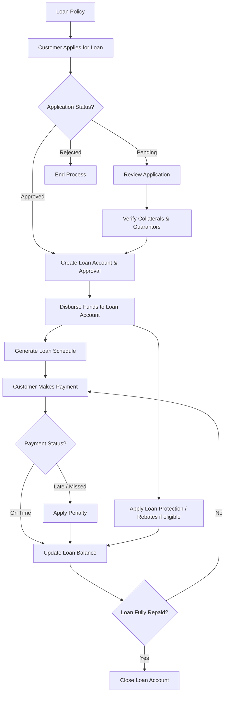

```php
<?php

use Illuminate\Database\Migrations\Migration;
use Illuminate\Database\Schema\Blueprint;
use Illuminate\Support\Facades\Schema;

return new class extends Migration {

    public function up(): void
    {
        /*
        |--------------------------------------------------------------------------
        | Loan Applications
        |--------------------------------------------------------------------------
        */
        Schema::create('loan_applications', function (Blueprint $table) {
            $table->id();

            $table->foreignId('customer_id')->constrained()->cascadeOnDelete();
            $table->foreignId('loan_policy_id')->constrained()->restrictOnDelete();
            $table->foreignId('loan_account_id')->nullable()->constrained()->nullOnDelete();

            $table->enum('loan_type', ['GENERAL','DEPOSIT','SECURED'])->default('GENERAL');
            $table->decimal('amount_requested', 18, 2);
            $table->text('purpose')->nullable();
            $table->date('application_date');

            $table->enum('status', ['PENDING','APPROVED','REJECTED','DISBURSED','CLOSED'])->default('PENDING');

            $table->timestamps();
        });

        /*
        |--------------------------------------------------------------------------
        | Loan Applicants
        |--------------------------------------------------------------------------
        */
        Schema::create('loan_applicants', function (Blueprint $table) {
            $table->id();

            $table->foreignId('loan_application_id')->constrained()->cascadeOnDelete();

            $table->enum('applicant_type', ['Individual','Organization']);
            $table->string('name', 150);
            $table->string('phone', 50)->nullable();
            $table->string('email', 100)->nullable();
            $table->date('dob')->nullable();
            $table->enum('gender', ['MALE','FEMALE','OTHER'])->nullable();
            $table->string('nid_or_registration_no', 50);

            $table->timestamps();
        });

        /*
        |--------------------------------------------------------------------------
        | Loan Collaterals
        |--------------------------------------------------------------------------
        */
        Schema::create('loan_collaterals', function (Blueprint $table) {
            $table->id();

            $table->foreignId('loan_application_id')->constrained()->cascadeOnDelete();
            $table->foreignId('loan_account_id')->nullable()->constrained()->nullOnDelete();
            $table->foreignId('deposit_account_id')->constrained()->restrictOnDelete();

            $table->enum('collateral_type', ['SURETY','LIEN','ASSET','PROPERTY','BLANK_CHEQUE']);

            $table->string('reference')->nullable();
            $table->decimal('value', 18, 2);
            $table->string('description')->nullable();

            $table->enum('status', ['PLEDGED','RELEASED','SEIZED'])->default('PLEDGED');

            $table->timestamps();
        });

        /*
        |--------------------------------------------------------------------------
        | Loan Guarantors
        |--------------------------------------------------------------------------
        */
        Schema::create('loan_guarantors', function (Blueprint $table) {
            $table->id();

            $table->foreignId('loan_application_id')->constrained()->cascadeOnDelete();
            $table->foreignId('loan_account_id')->nullable()->constrained()->nullOnDelete();
            $table->foreignId('customer_id')->constrained()->restrictOnDelete();

            $table->timestamps();
        });

        /*
        |--------------------------------------------------------------------------
        | Applicant Work Details
        |--------------------------------------------------------------------------
        */
        Schema::create('loan_applicant_work_details', function (Blueprint $table) {
            $table->id();

            $table->foreignId('loan_application_id')->constrained()->cascadeOnDelete();

            $table->string('employer_name', 100)->nullable();
            $table->string('designation', 50)->nullable();

            $table->enum('employment_type', ['PERMANENT','CONTRACT','SELF_EMPLOYED','OTHER'])->default('OTHER');

            $table->decimal('monthly_income', 18, 2)->nullable();
            $table->integer('years_of_service')->nullable();

            $table->timestamps();
        });

        /*
        |--------------------------------------------------------------------------
        | Applicant Assets
        |--------------------------------------------------------------------------
        */
        Schema::create('loan_applicant_assets', function (Blueprint $table) {
            $table->id();

            $table->foreignId('loan_application_id')->constrained()->cascadeOnDelete();

            $table->string('asset_type', 50);
            $table->string('description')->nullable();
            $table->decimal('value', 18, 2);

            $table->timestamps();
        });

        /*
        |--------------------------------------------------------------------------
        | Applicant Incomes
        |--------------------------------------------------------------------------
        */
        Schema::create('loan_applicant_incomes', function (Blueprint $table) {
            $table->id();

            $table->foreignId('loan_application_id')->constrained()->cascadeOnDelete();

            $table->string('source', 100)->nullable();
            $table->decimal('monthly_amount', 18, 2)->nullable();
            $table->enum('frequency', ['MONTHLY','ANNUAL','OTHER'])->default('MONTHLY');

            $table->timestamps();
        });

        /*
        |--------------------------------------------------------------------------
        | Applicant Expenses
        |--------------------------------------------------------------------------
        */
        Schema::create('loan_applicant_expenses', function (Blueprint $table) {
            $table->id();

            $table->foreignId('loan_application_id')->constrained()->cascadeOnDelete();

            $table->string('category', 50)->nullable();
            $table->decimal('monthly_amount', 18, 2)->nullable();

            $table->timestamps();
        });

        /*
        |--------------------------------------------------------------------------
        | Supporting Documents
        |--------------------------------------------------------------------------
        */
        Schema::create('loan_application_supporting_docs', function (Blueprint $table) {
            $table->id();

            $table->foreignId('loan_application_id')->constrained()->cascadeOnDelete();

            $table->string('file_name');
            $table->string('file_path');
            $table->string('mime', 50)->nullable();
            $table->string('document_type', 50)->nullable();

            $table->timestamp('uploaded_at')->useCurrent();
        });

        /*
        |--------------------------------------------------------------------------
        | Loan Approvals
        |--------------------------------------------------------------------------
        */
        Schema::create('loan_approvals', function (Blueprint $table) {
            $table->id();

            $table->foreignId('loan_application_id')->constrained()->cascadeOnDelete();
            $table->foreignId('approved_by')->constrained('users')->restrictOnDelete();
            $table->foreignId('loan_account_id')->constrained()->restrictOnDelete();

            $table->decimal('approved_amount', 18, 2);
            $table->decimal('interest_rate', 5, 2);
            $table->json('repayment_schedule');
            $table->date('approved_date');

            $table->timestamps();
        });

        /*
        |--------------------------------------------------------------------------
        | Loan Disbursements
        |--------------------------------------------------------------------------
        */
        Schema::create('loan_disbursements', function (Blueprint $table) {
            $table->id();

            $table->foreignId('loan_application_id')->constrained()->cascadeOnDelete();
            $table->foreignId('loan_account_id')->constrained()->restrictOnDelete();

            $table->date('disbursement_date');
            $table->decimal('amount', 18, 2);

            $table->timestamps();
        });

        /*
        |--------------------------------------------------------------------------
        | Status History (Audit Trail)
        |--------------------------------------------------------------------------
        */
        Schema::create('loan_application_status_history', function (Blueprint $table) {
            $table->id();

            $table->foreignId('loan_application_id')->constrained()->cascadeOnDelete();
            $table->foreignId('changed_by')->constrained('users')->restrictOnDelete();

            $table->enum('status', ['PENDING','APPROVED','REJECTED','DISBURSED','CLOSED']);

            $table->timestamp('changed_at')->useCurrent();
        });
    }

    public function down(): void
    {
        Schema::dropIfExists('loan_application_status_history');
        Schema::dropIfExists('loan_disbursements');
        Schema::dropIfExists('loan_approvals');
        Schema::dropIfExists('loan_application_supporting_docs');
        Schema::dropIfExists('loan_applicant_expenses');
        Schema::dropIfExists('loan_applicant_incomes');
        Schema::dropIfExists('loan_applicant_assets');
        Schema::dropIfExists('loan_applicant_work_details');
        Schema::dropIfExists('loan_guarantors');
        Schema::dropIfExists('loan_collaterals');
        Schema::dropIfExists('loan_applicants');
        Schema::dropIfExists('loan_applications');
    }
};
```

## Lifecycle Flow


