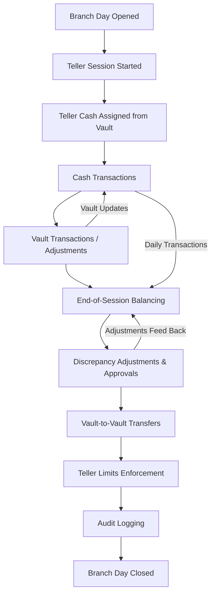

```php
<?php
use Illuminate\Database\Migrations\Migration;
use Illuminate\Database\Schema\Blueprint;
use Illuminate\Support\Facades\Schema;

return new class extends Migration {
    public function up(): void
    {
        Schema::create('branch_days', function (Blueprint $table) {
            $table->id();
            $table->foreignId('branch_id')->constrained()->cascadeOnDelete();
            $table->date('business_date');
            $table->timestamp('opened_at')->nullable();
            $table->timestamp('closed_at')->nullable();
            $table->foreignId('opened_by')->nullable()->constrained('users')->nullOnDelete();
            $table->foreignId('closed_by')->nullable()->constrained('users')->nullOnDelete();
            $table->enum('status', ['OPEN', 'CLOSED'])->default('OPEN');
            $table->timestamps();
            $table->unique(['branch_id', 'business_date']);
        });

        Schema::create('denominations', function (Blueprint $table) {
            $table->id();
            $table->integer('value');
            $table->boolean('is_active')->default(true);
            $table->timestamps();
        });

        Schema::create('vaults', function (Blueprint $table) {
            $table->id();
            $table->foreignId('branch_id')->constrained()->cascadeOnDelete();
            $table->string('name');
            $table->decimal('total_balance', 18, 2)->default(0);
            $table->boolean('is_active')->default(true);
            $table->timestamps();
        });

        Schema::create('tellers', function (Blueprint $table) {
            $table->id();
            $table->foreignId('user_id')->constrained()->cascadeOnDelete();
            $table->foreignId('branch_id')->constrained()->cascadeOnDelete();
            $table->string('code', 20)->unique();
            $table->string('name');
            $table->boolean('is_active')->default(true);
            $table->timestamps();
        });

        Schema::create('vault_denominations', function (Blueprint $table) {
            $table->id();
            $table->foreignId('vault_id')->constrained()->cascadeOnDelete();
            $table->foreignId('denomination_id')->constrained()->cascadeOnDelete();
            $table->integer('count')->default(0);
            $table->timestamps();
        });

        Schema::create('vault_transactions', function (Blueprint $table) {
            $table->id();
            $table->foreignId('vault_id')->constrained()->cascadeOnDelete();
            $table->foreignId('teller_id')->nullable()->constrained()->nullOnDelete();
            $table->decimal('amount', 18, 2);
            $table->enum('type', ['IN', 'OUT']);
            $table->string('reference')->nullable();
            $table->timestamp('transaction_date');
            $table->text('remarks')->nullable();
            $table->timestamps();
        });

        Schema::create('teller_sessions', function (Blueprint $table) {
            $table->id();
            $table->foreignId('teller_id')->constrained()->cascadeOnDelete();
            $table->foreignId('branch_day_id')->constrained()->cascadeOnDelete();
            $table->decimal('opening_cash', 18, 2)->default(0);
            $table->decimal('closing_cash', 18, 2)->nullable();
            $table->timestamp('opened_at');
            $table->timestamp('closed_at')->nullable();
            $table->enum('status', ['OPEN', 'CLOSED'])->default('OPEN');
            $table->timestamps();
        });

        Schema::create('cash_drawers', function (Blueprint $table) {
            $table->id();
            $table->foreignId('teller_session_id')->constrained()->cascadeOnDelete();
            $table->foreignId('vault_id')->constrained()->cascadeOnDelete();
            $table->decimal('opening_balance', 18, 2)->default(0);
            $table->decimal('closing_balance', 18, 2)->nullable();
            $table->timestamps();
        });

        Schema::create('cash_transactions', function (Blueprint $table) {
            $table->id();
            $table->foreignId('cash_drawer_id')->constrained()->cascadeOnDelete();
            $table->decimal('amount', 18, 2);
            $table->enum('type', ['CASH_IN', 'CASH_OUT']);
            $table->morphs('source');
            $table->string('reference')->nullable();
            $table->timestamp('transaction_date');
            $table->text('remarks')->nullable();
            $table->timestamps();
            $table->index('transaction_date');
        });

        Schema::create('cash_balancings', function (Blueprint $table) {
            $table->id();
            $table->foreignId('cash_drawer_id')->constrained()->cascadeOnDelete();
            $table->decimal('expected_balance', 18, 2);
            $table->decimal('actual_balance', 18, 2);
            $table->decimal('difference', 18, 2);
            $table->foreignId('verified_by')->nullable()->constrained('users')->nullOnDelete();
            $table->timestamp('balanced_at');
            $table->text('remarks')->nullable();
            $table->timestamps();
        });

        Schema::create('teller_limits', function (Blueprint $table) {
            $table->id();
            $table->foreignId('teller_id')->constrained()->cascadeOnDelete();
            $table->decimal('max_cash_limit', 18, 2);
            $table->decimal('max_transaction_limit', 18, 2);
            $table->timestamps();
        });

        Schema::create('cash_adjustments', function (Blueprint $table) {
            $table->id();
            $table->foreignId('cash_drawer_id')->constrained()->cascadeOnDelete();
            $table->decimal('amount', 18, 2);
            $table->enum('type', ['SHORTAGE', 'EXCESS']);
            $table->text('reason')->nullable();
            $table->foreignId('approved_by')->nullable()->constrained('users')->nullOnDelete();
            $table->timestamps();
        });

        Schema::create('teller_vault_transfers', function (Blueprint $table) {
            $table->id();
            $table->foreignId('vault_id')->constrained()->cascadeOnDelete();
            $table->foreignId('teller_session_id')->constrained()->cascadeOnDelete();
            $table->decimal('amount', 18, 2);
            $table->enum('type', ['CASH_TO_TELLER', 'CASH_TO_VAULT']);
            $table->timestamp('transfer_date');
            $table->timestamps();
        });

        Schema::create('vault_transfers', function (Blueprint $table) {
            $table->id();
            $table->foreignId('from_vault_id')->constrained('vaults')->cascadeOnDelete();
            $table->foreignId('to_vault_id')->constrained('vaults')->cascadeOnDelete();
            $table->decimal('amount', 18, 2);
            $table->timestamp('transfer_date');
            $table->foreignId('approved_by')->nullable()->constrained('users')->nullOnDelete();
            $table->text('remarks')->nullable();
            $table->timestamps();
        });

        Schema::create('cash_audit_logs', function (Blueprint $table) {
            $table->id();
            $table->foreignId('cash_drawer_id')->nullable()->constrained()->nullOnDelete();
            $table->foreignId('user_id')->constrained()->cascadeOnDelete();
            $table->string('action');
            $table->text('details')->nullable();
            $table->timestamp('action_time');
            $table->timestamps();
        });
    }

    public function down(): void
    {
        Schema::dropIfExists('cash_audit_logs');
        Schema::dropIfExists('vault_transfers');
        Schema::dropIfExists('teller_vault_transfers');
        Schema::dropIfExists('cash_adjustments');
        Schema::dropIfExists('teller_limits');
        Schema::dropIfExists('cash_balancings');
        Schema::dropIfExists('cash_transactions');
        Schema::dropIfExists('cash_drawers');
        Schema::dropIfExists('teller_sessions');
        Schema::dropIfExists('vault_transactions');
        Schema::dropIfExists('vault_denominations');
        Schema::dropIfExists('denominations');
        Schema::dropIfExists('vaults');
        Schema::dropIfExists('tellers');
        Schema::dropIfExists('branch_days');
    }
};
```

# Branch Cash Management Action Flow

This document outlines the step-by-step operational flow for branch, teller, vault, and cash drawer management.

---

## **Action Flow Steps**

1. **Branch Day Initialization**
    - Admin/Branch Manager opens the branch day.
    - `branch_days` record created:
        - `business_date`, `opened_at`, `opened_by`
        - `status = OPEN`
    - **Effect:** Tellers can start sessions.

2. **Teller Session Start**
    - Teller starts their session.
    - `teller_sessions` created:
        - `teller_id`, `branch_day_id`, `opening_cash`
        - `opened_at`, `status = OPEN`
    - Cash drawer assigned (`cash_drawers`).

3. **Vault Funding / Teller Cash Assignment**
    - Teller receives cash from vault:
        - `teller_vault_transfers` → type `CASH_TO_TELLER`
    - Teller returns cash to vault:
        - `teller_vault_transfers` → type `CASH_TO_VAULT`
    - Vault balances update accordingly.

4. **Cash Transactions**
    - Teller performs transactions:
        - `cash_transactions` → `CASH_IN` / `CASH_OUT`
        - Linked to source (deposit, withdrawal, payment)
    - Cash drawer balances update dynamically.

5. **Vault Transactions**
    - Any vault-level IN/OUT adjustments:
        - `vault_transactions` → `vault_id`, optional `teller_id`
    - Vault total balances updated.

6. **End-of-Session Balancing**
    - Teller closes session:
        - `teller_sessions.closed_at`, `status = CLOSED`
        - Cash drawer `closing_balance` recorded
    - `cash_balancings`:
        - Compare `expected_balance` vs `actual_balance`
        - Calculate `difference`
        - Verified by supervisor (`verified_by`)

7. **Adjustments & Approvals**
    - Any discrepancies corrected:
        - `cash_adjustments` → `SHORTAGE` / `EXCESS`
        - Reason and approval logged

8. **Vault-to-Vault Transfers**
    - Inter-vault cash movements:
        - `vault_transfers` → `from_vault_id`, `to_vault_id`
        - Optional approval and remarks

9. **Teller Limits Enforcement**
    - Checks against `teller_limits`:
        - `max_cash_limit`, `max_transaction_limit`
    - Prevents exceeding operational limits

10. **Audit Logging**
    - All cash operations logged:
        - `cash_audit_logs` → `cash_drawer_id`, `user_id`, `action`, `details`, `action_time`

11. **Branch Day Closure**
    - Branch manager closes the day:
        - `branch_days.closed_at`, `closed_by`
        - `status = CLOSED`
    - No further sessions allowed until next business day

---

## **Visual Action Flow Chart**


