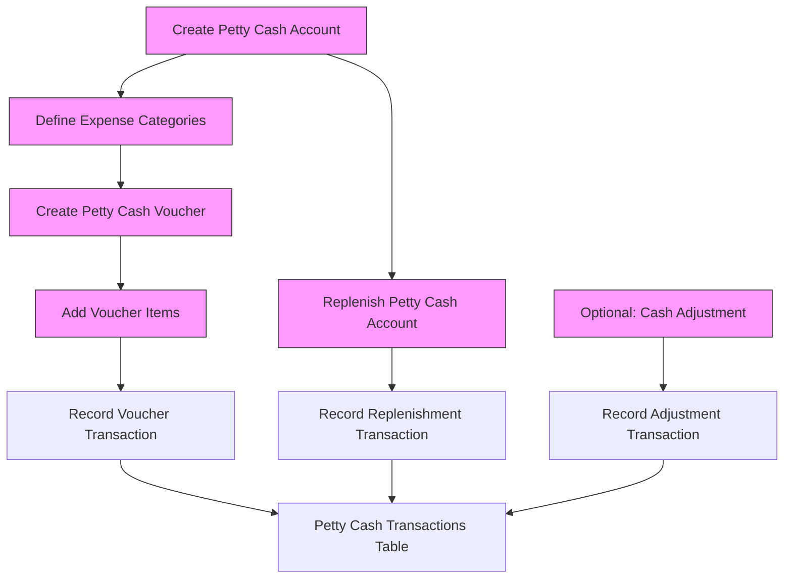

```php
<?php

use Illuminate\Database\Migrations\Migration;
use Illuminate\Database\Schema\Blueprint;
use Illuminate\Support\Facades\Schema;

return new class extends Migration {

    public function up(): void
    {
        // =========================
        // 1. Petty Cash Accounts
        // =========================
        Schema::create('petty_cash_accounts', function (Blueprint $table) {
            $table->id();
            $table->string('name'); // e.g., Office Petty Cash
            $table->string('code')->unique();
            $table->foreignId('branch_id')->constrained()->cascadeOnDelete();
            $table->foreignId('custodian_id')->nullable()->constrained('users')->nullOnDelete();
            $table->decimal('imprest_amount', 15, 2)->default(0); // fixed fund
            $table->decimal('current_balance', 15, 2)->default(0);
            $table->boolean('is_active')->default(true);
            $table->timestamps();

            $table->index(['branch_id', 'custodian_id']);
        });

        // =========================
        // 2. Expense Categories
        // =========================
        Schema::create('expense_categories', function (Blueprint $table) {
            $table->id();
            $table->string('name');
            $table->string('code')->unique();
            $table->text('description')->nullable();
            $table->timestamps();
        });

        // =========================
        // 3. Petty Cash Vouchers
        // =========================
        Schema::create('petty_cash_vouchers', function (Blueprint $table) {
            $table->id();
            $table->string('voucher_no')->unique();
            $table->foreignId('petty_cash_account_id')->constrained()->cascadeOnDelete();
            $table->date('voucher_date');
            $table->decimal('total_amount', 15, 2);
            $table->text('remarks')->nullable();
            $table->foreignId('created_by')->constrained('users');
            $table->timestamps();

            $table->index(['petty_cash_account_id', 'created_by']);
        });

        // =========================
        // 4. Voucher Line Items
        // =========================
        Schema::create('petty_cash_voucher_items', function (Blueprint $table) {
            $table->id();
            $table->foreignId('petty_cash_voucher_id')->constrained()->cascadeOnDelete();
            $table->foreignId('expense_category_id')->constrained()->cascadeOnDelete();
            $table->decimal('amount', 15, 2);
            $table->text('description')->nullable();
            $table->string('receipt_no')->nullable();
            $table->timestamps();

            $table->index(['petty_cash_voucher_id', 'expense_category_id']);
        });

        // =========================
        // 5. Replenishments / Top-ups
        // =========================
        Schema::create('petty_cash_replenishments', function (Blueprint $table) {
            $table->id();
            $table->string('replenish_no')->unique();
            $table->foreignId('petty_cash_account_id')->constrained()->cascadeOnDelete();
            $table->string('source_account'); // free-text instead of ledger_id
            $table->decimal('amount', 15, 2);
            $table->date('replenish_date');
            $table->text('remarks')->nullable();
            $table->foreignId('approved_by')->nullable()->constrained('users')->nullOnDelete();
            $table->timestamps();

            $table->index(['petty_cash_account_id', 'approved_by']);
        });

        // =========================
        // 6. Transactions Log (Polymorphic)
        // =========================
        Schema::create('petty_cash_transactions', function (Blueprint $table) {
            $table->id();
            $table->foreignId('petty_cash_account_id')->constrained()->cascadeOnDelete();
            $table->morphs('reference'); // reference_id + reference_type (voucher/replenish/adjustment)
            $table->decimal('debit', 15, 2)->default(0);
            $table->decimal('credit', 15, 2)->default(0);
            $table->decimal('balance', 15, 2);
            $table->date('transaction_date');
            $table->timestamps();

            $table->index(['petty_cash_account_id', 'transaction_date']);
        });
    }

    public function down(): void
    {
        Schema::dropIfExists('petty_cash_transactions');
        Schema::dropIfExists('petty_cash_replenishments');
        Schema::dropIfExists('petty_cash_voucher_items');
        Schema::dropIfExists('petty_cash_vouchers');
        Schema::dropIfExists('expense_categories');
        Schema::dropIfExists('petty_cash_accounts');
    }
};
```

# Petty Cash Module Documentation

### Step-by-Step Actions

1. **Petty Cash Account Setup**
    - Create account per branch.
    - Table: `petty_cash_accounts`
    - Key Fields: `name`, `code`, `branch_id`, `custodian_id`, `imprest_amount`, `current_balance`

2. **Define Expense Categories**
    - Table: `expense_categories`
    - Key Fields: `name`, `code`, `description`

3. **Voucher Creation**
    - Table: `petty_cash_vouchers`
    - Key Fields: `voucher_no`, `petty_cash_account_id`, `voucher_date`, `total_amount`, `created_by`
    - Sub-action: Add voucher items (`petty_cash_voucher_items`)
        - Fields: `petty_cash_voucher_id`, `expense_category_id`, `amount`, `description`, `receipt_no`

4. **Replenishment / Top-up**
    - Table: `petty_cash_replenishments`
    - Fields: `replenish_no`, `petty_cash_account_id`, `source_account`, `amount`, `replenish_date`, `approved_by`

5. **Transaction Logging**
    - Table: `petty_cash_transactions`
    - All vouchers, replenishments, and adjustments are logged here.
    - Fields: `petty_cash_account_id`, `reference_type`, `reference_id`, `debit`, `credit`, `balance`, `transaction_date`

6. **Optional Adjustments**
    - Record shortages/excesses manually.
    - Logged as `reference_type = adjustment` in `petty_cash_transactions`.

---

## 3. Visual Flowchart


