```php
<?php

use Illuminate\Database\Migrations\Migration;
use Illuminate\Database\Schema\Blueprint;
use Illuminate\Support\Facades\Schema;

return new class extends Migration {
    public function up(): void
    {
        // ------------------------
        // 1. Customers
        // ------------------------
        Schema::create('customers', function (Blueprint $table) {
            $table->id();
            $table->string('customer_no')->unique();
            $table->string('full_name');
            $table->date('dob')->nullable();
            $table->enum('gender',['MALE','FEMALE','OTHER'])->nullable();
            $table->enum('kyc_status',['PENDING','VERIFIED'])->default('PENDING');
            $table->timestamps();
        });

        // ------------------------
        // 2. Deposit Products
        // ------------------------
        Schema::create('deposit_products', function (Blueprint $table) {
            $table->id();
            $table->string('code')->unique(); // SAV, SHARE, TERM, FD, RD
            $table->string('name');
            $table->enum('category',['SAVINGS','SHARE','TERM']);
            $table->enum('interest_type',['NONE','SIMPLE','COMPOUND'])->default('NONE');
            $table->decimal('interest_rate',5,2)->default(0);
            $table->decimal('min_balance',15,2)->default(0);
            $table->boolean('tenure_required')->default(false);
            $table->integer('min_tenure_months')->nullable();
            $table->integer('max_tenure_months')->nullable();
            $table->enum('withdrawal_rule',['ANYTIME','PENALTY','LOCKED'])->default('ANYTIME');
            $table->enum('installment_frequency',['MONTHLY','QUARTERLY','ANNUAL'])->nullable();
            $table->boolean('allow_missed_installments')->default(false);
            $table->boolean('is_interest_payout_allowed')->default(true);
            $table->boolean('is_joint_allowed')->default(false);
            $table->boolean('is_active')->default(true);
            $table->timestamps();
        });

        // ------------------------
        // 3. Deposit Accounts
        // ------------------------
        Schema::create('deposit_accounts', function (Blueprint $table) {
            $table->id();
            $table->string('account_no')->unique();
            $table->foreignId('product_id')->constrained('deposit_products');
            $table->enum('status',['ACTIVE','DORMANT','MATURED','CLOSED'])->default('ACTIVE');
            $table->date('opened_at')->nullable();
            $table->date('maturity_date')->nullable();
            $table->decimal('principal_amount',15,2)->default(0);
            $table->boolean('auto_renew')->default(false);
            $table->timestamps();
        });

        // ------------------------
        // 4. Deposit Account Holders
        // ------------------------
        Schema::create('deposit_account_holders', function (Blueprint $table) {
            $table->id();
            $table->foreignId('deposit_account_id')->constrained('deposit_accounts');
            $table->foreignId('customer_id')->constrained('customers');
            $table->enum('role',['PRIMARY','JOINT','NOMINEE','GUARDIAN'])->default('PRIMARY');
            $table->enum('operating_mode',['EITHER','JOINT'])->default('EITHER');
        });

        // ------------------------
        // 5. Introducers
        // ------------------------
        Schema::create('introducers', function (Blueprint $table) {
            $table->id();
            $table->foreignId('customer_id')->constrained('customers');
            $table->foreignId('introducer_id')->constrained('customers');
            $table->decimal('commission_rate',5,2)->default(0);
            $table->timestamps();
        });

        // ------------------------
        // 6. Nominees
        // ------------------------
        Schema::create('nominees', function (Blueprint $table) {
            $table->id();
            $table->foreignId('deposit_account_id')->constrained('deposit_accounts');
            $table->foreignId('customer_id')->constrained('customers');
            $table->string('relationship')->nullable();
            $table->decimal('share_percentage',5,2)->default(100);
            $table->boolean('is_primary')->default(false);
            $table->timestamps();
        });

        // ------------------------
        // 7. Share Accounts
        // ------------------------
        Schema::create('share_accounts', function (Blueprint $table) {
            $table->id();
            $table->foreignId('deposit_account_id')->constrained('deposit_accounts');
            $table->integer('shares_owned')->default(0);
            $table->decimal('share_value',10,2)->default(0);
            $table->boolean('voting_rights')->default(true);
            $table->timestamps();
        });

        // ------------------------
        // 8. Share Dividends
        // ------------------------
        Schema::create('share_dividends', function (Blueprint $table) {
            $table->id();
            $table->foreignId('share_account_id')->constrained('share_accounts');
            $table->decimal('dividend_amount',15,2);
            $table->date('dividend_date');
            $table->enum('status',['PENDING','PAID'])->default('PENDING');
            $table->timestamps();
        });

        // ------------------------
        // 9. Term / Fixed Deposit Details
        // ------------------------
        Schema::create('term_deposit_details', function (Blueprint $table) {
            $table->foreignId('deposit_account_id')->primary()->constrained('deposit_accounts');
            $table->integer('tenure_months');
            $table->decimal('maturity_amount',15,2);
            $table->decimal('premature_penalty_rate',5,2)->default(0);
            $table->enum('payout_mode',['MATURITY','MONTHLY'])->default('MATURITY');
        });

        // ------------------------
        // 10. Recurring Deposit Details
        // ------------------------
        Schema::create('recurring_deposit_details', function (Blueprint $table) {
            $table->foreignId('deposit_account_id')->primary()->constrained('deposit_accounts');
            $table->decimal('installment_amount',15,2);
            $table->enum('installment_frequency',['MONTHLY','QUARTERLY','ANNUAL'])->default('MONTHLY');
            $table->integer('total_installments');
            $table->integer('paid_installments')->default(0);
            $table->date('next_due_date')->nullable();
            $table->decimal('penalty_rate',5,2)->default(0);
            $table->integer('grace_days')->default(0);
            $table->decimal('maturity_amount',15,2)->default(0);
        });

        // ------------------------
        // 11. RD Installments
        // ------------------------
        Schema::create('rd_installments', function (Blueprint $table) {
            $table->id();
            $table->foreignId('deposit_account_id')->constrained('deposit_accounts');
            $table->integer('installment_no');
            $table->date('due_date');
            $table->decimal('amount_due',15,2);
            $table->decimal('amount_paid',15,2)->default(0);
            $table->date('paid_on')->nullable();
            $table->enum('status',['DUE','PAID','MISSED'])->default('DUE');
            $table->decimal('penalty_amount',15,2)->default(0);
        });

        // ------------------------
        // 12. Deposit Transactions
        // ------------------------
        Schema::create('deposit_transactions', function (Blueprint $table) {
            $table->id();
            $table->foreignId('deposit_account_id')->constrained('deposit_accounts');
            $table->enum('txn_type',['DEPOSIT','WITHDRAWAL','INTEREST','PENALTY']);
            $table->decimal('amount',15,2);
            $table->dateTime('txn_date');
            $table->string('reference')->nullable();
        });

        // ------------------------
        // 13. Interest Accruals
        // ------------------------
        Schema::create('interest_accruals', function (Blueprint $table) {
            $table->id();
            $table->foreignId('deposit_account_id')->constrained('deposit_accounts');
            $table->date('accrual_date');
            $table->decimal('interest_amount',15,2);
            $table->boolean('posted')->default(false);
        });

        // ------------------------
        // 14. Ledger Accounts
        // ------------------------
        Schema::create('accounts', function (Blueprint $table) {
            $table->id();
            $table->string('code')->unique();
            $table->string('name');
            $table->enum('type',['ASSET','LIABILITY','INCOME','EXPENSE']);
            $table->timestamps();
        });

        // ------------------------
        // 15. Journals
        // ------------------------
        Schema::create('journals', function (Blueprint $table) {
            $table->id();
            $table->string('journal_no')->unique();
            $table->date('journal_date');
            $table->enum('status',['DRAFT','POSTED','CANCELLED'])->default('DRAFT');
            $table->timestamps();
        });

        // ------------------------
        // 16. Journal Entries
        // ------------------------
        Schema::create('journal_entries', function (Blueprint $table) {
            $table->id();
            $table->foreignId('journal_id')->constrained('journals');
            $table->foreignId('account_id')->constrained('accounts');
            $table->decimal('debit',15,2)->default(0);
            $table->decimal('credit',15,2)->default(0);
        });
    }

    public function down(): void
    {
        Schema::dropIfExists('journal_entries');
        Schema::dropIfExists('journals');
        Schema::dropIfExists('accounts');
        Schema::dropIfExists('interest_accruals');
        Schema::dropIfExists('deposit_transactions');
        Schema::dropIfExists('rd_installments');
        Schema::dropIfExists('recurring_deposit_details');
        Schema::dropIfExists('term_deposit_details');
        Schema::dropIfExists('share_dividends');
        Schema::dropIfExists('share_accounts');
        Schema::dropIfExists('nominees');
        Schema::dropIfExists('introducers');
        Schema::dropIfExists('deposit_account_holders');
        Schema::dropIfExists('deposit_accounts');
        Schema::dropIfExists('deposit_products');
        Schema::dropIfExists('customers');
    }
};
```

```mermaid
erDiagram

    CUSTOMERS {
        id
        customer_no
        full_name
        dob
        gender
        kyc_status
    }

    DEPOSIT_PRODUCTS {
        id
        code
        name
        category
        interest_type
        interest_rate
    }

    DEPOSIT_ACCOUNTS {
        id
        account_no
        product_id
        status
        opened_at
        maturity_date
        principal_amount
        auto_renew
    }

    DEPOSIT_ACCOUNT_HOLDERS {
        id
        deposit_account_id
        customer_id
        role
    }

    INTRODUCERS {
        id
        customer_id
        introducer_id
        commission_rate
    }

    NOMINEES {
        id
        deposit_account_id
        customer_id
        relationship
        share_percentage
        is_primary
    }

    SHARE_ACCOUNTS {
        id
        deposit_account_id
        shares_owned
        share_value
    }

    SHARE_DIVIDENDS {
        id
        share_account_id
        dividend_amount
        dividend_date
    }

    TERM_DEPOSIT_DETAILS {
        deposit_account_id
        tenure_months
        maturity_amount
        premature_penalty_rate
    }

    RECURRING_DEPOSIT_DETAILS {
        deposit_account_id
        installment_amount
        installment_frequency
        total_installments
        paid_installments
        next_due_date
        penalty_rate
        grace_days
    }

    RD_INSTALLMENTS {
        id
        deposit_account_id
        installment_no
        due_date
        amount_due
        amount_paid
        paid_on
        status
    }

    DEPOSIT_TRANSACTIONS {
        id
        deposit_account_id
        txn_type
        amount
        txn_date
        reference
    }

    INTEREST_ACCRUALS {
        id
        deposit_account_id
        accrual_date
        interest_amount
    }

    ACCOUNTS {
        id
        code
        name
        type
    }

    JOURNALS {
        id
        journal_no
        journal_date
        status
    }

    JOURNAL_ENTRIES {
        id
        journal_id
        account_id
        debit
    }

    %% Relationships
    CUSTOMERS ||--o{ DEPOSIT_ACCOUNT_HOLDERS : holds
    DEPOSIT_ACCOUNTS ||--o{ DEPOSIT_ACCOUNT_HOLDERS : includes
    DEPOSIT_PRODUCTS ||--o{ DEPOSIT_ACCOUNTS : defines
    CUSTOMERS ||--o{ INTRODUCERS : introduces
    CUSTOMERS ||--o{ INTRODUCERS : is_introduced
    DEPOSIT_ACCOUNTS ||--o{ NOMINEES : has
    CUSTOMERS ||--o{ NOMINEES : nominee_of
    DEPOSIT_ACCOUNTS ||--o{ SHARE_ACCOUNTS : has
    SHARE_ACCOUNTS ||--o{ SHARE_DIVIDENDS : declares
    DEPOSIT_ACCOUNTS ||--o{ TERM_DEPOSIT_DETAILS : extends
    DEPOSIT_ACCOUNTS ||--o{ RECURRING_DEPOSIT_DETAILS : extends
    DEPOSIT_ACCOUNTS ||--o{ RD_INSTALLMENTS : schedules
    DEPOSIT_ACCOUNTS ||--o{ DEPOSIT_TRANSACTIONS : logs
    DEPOSIT_ACCOUNTS ||--o{ INTEREST_ACCRUALS : accrues
    JOURNALS ||--o{ JOURNAL_ENTRIES : contains
    ACCOUNTS ||--o{ JOURNAL_ENTRIES : used_in

```


