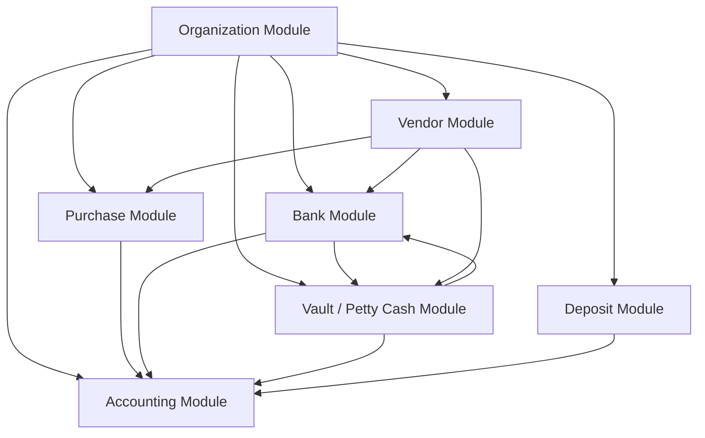

# Financial System Architecture

This document describes the architecture and relationships between the core modules of the financial management system.

The system is designed with modular components that manage organizational structure, banking operations, deposits, vendors, cash handling, purchases, and accounting.

---

# Core Modules

## 1. Organization Module

The Organization module manages the system structure.

### Responsibilities

- Companies
- Branches
- Users
- Roles & Permissions

### Purpose

Defines who can access the system and where journal_entries occur.

---

## 2. Bank Module

Manages bank institutions and company bank accounts.

### Features

- Bank management
- Bank branches
- Bank accounts
- Bank journal_entries
- Cheques
- Bank reconciliation

### Used For

- Vendor payments
- Deposit transfers
- Financial reconciliation

---

## 3. Deposit Module

Manages customer deposit products and accounts.

### Features

- Deposit products
- Deposit accounts
- Account holders
- Nominees
- Transactions
- Interest accrual
- Penalties
- Cheque books
- Statements

### Used For

- Customer savings
- Recurring deposits
- Term deposits
- Share accounts

---

## 4. Vault / Petty Cash Module

Handles internal cash management.

### Features

- Vaults
- Cash drawers
- Cash journal_entries
- Cash transfers
- Cash balance tracking

### Used For

- Branch cash handling
- Daily cash operations
- Teller journal_entries

---

## 5. Vendor Module

Manages suppliers and vendor financial interactions.

### Features

- Vendors
- Vendor contacts
- Vendor addresses
- Vendor categories
- Vendor journal_entries
- Vendor ledger

### Used For

- Purchase payments
- Supplier management

---

## 6. Purchase Module

Handles procurement from vendors.

### Features

- Purchase orders
- Vendor invoices
- Purchase approval
- Payment processing

### Used For

- Vendor procurement workflow

---

## 7. Accounting Module

The Accounting module records all financial activities.

### Features

- Chart of Accounts
- Journals
- Ledger
- Financial reports
- Trial balance

### Used For

- Financial reporting
- Audit tracking

---

# System Interaction Flow

The modules interact to complete financial operations across the organization.

Example:

Vendor Invoice → Purchase Module → Payment via Bank → Accounting Ledger Entry

---

# System Architecture Diagram

