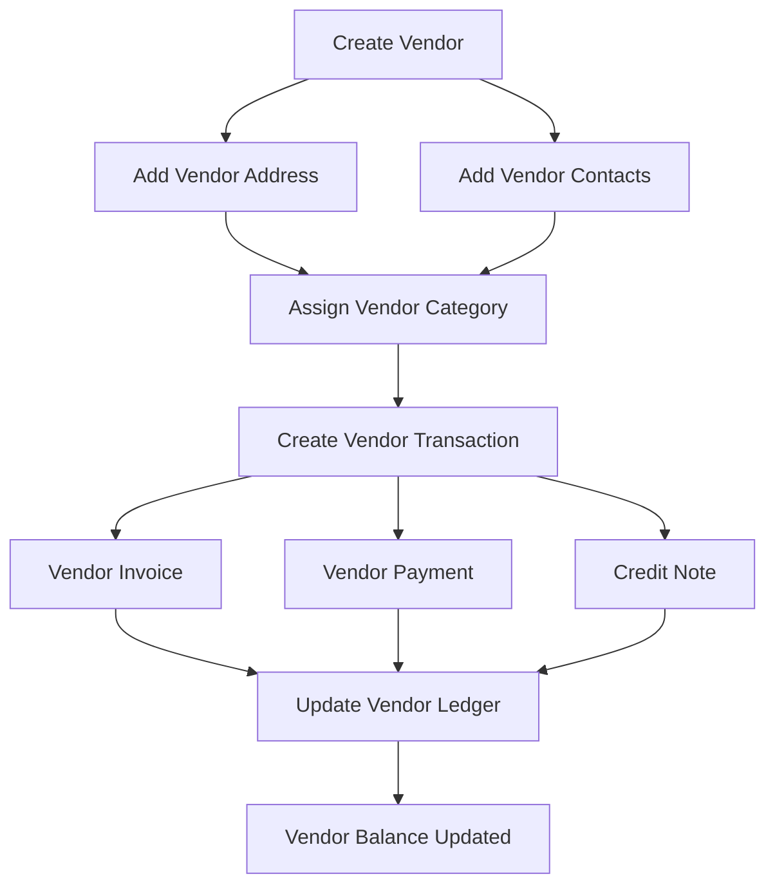

# Vendor Module Action Flow

The Vendor Module manages suppliers, their contact information, categorization, and financial journals such as invoices and payments.

---

# 1. Vendor Creation

A vendor (supplier) must be created before any procurement or payment activity.

### Steps

1. Admin opens **Vendor Management**
2. Click **Create Vendor**
3. Enter vendor information:
    - Name
    - Short Name
    - Vendor Code
    - Email
    - Phone
    - Website
4. Save Vendor

### Result

Vendor record is created and becomes available for journals.

---

# 2. Add Vendor Address

A vendor may have multiple addresses such as head office, branch, or warehouse.

### Steps

1. Open Vendor Profile
2. Add Address
3. Provide:
    - Address Type
    - Address Line 1
    - Address Line 2
    - City
    - State
    - Postal Code
    - Country

### Result

Vendor address stored for logistics and documentation.

---

# 3. Add Vendor Contacts

Each vendor may have multiple contact persons.

### Steps

1. Open Vendor Profile
2. Add Contact
3. Provide:
    - Name
    - Designation
    - Email
    - Phone
    - Contact Type

### Contact Types

- Primary
- Secondary
- Accounting
- Logistics

### Result

Vendor communication details stored.

---

# 4. Assign Vendor Category

Categories help organize vendors based on business type.

### Examples

- Raw Materials
- Equipment Supplier
- Service Provider
- Logistics Partner

### Steps

1. Create Category
2. Assign Category to Vendor

### Result

Vendor becomes part of categorized supplier groups.

---

# 5. Vendor Transactions

Vendor journals track financial interactions with suppliers.

### Transaction Types

| Type        | Description                 |
| ----------- | --------------------------- |
| INVOICE     | Vendor bill received        |
| PAYMENT     | Payment made to vendor      |
| CREDIT_NOTE | Vendor refund or adjustment |

### Steps

1. Select Vendor
2. Create Transaction
3. Choose transaction type
4. Enter:
    - Amount
    - Date
    - Reference
    - Remarks

### Result

Vendor ledger updated with debit/credit entries.

---

# 6. Vendor Ledger / Balance Tracking

Each transaction updates the vendor balance.

### Ledger Logic

Debit → Vendor owes money  
Credit → Payment made to vendor

### Result

System maintains running vendor balance.

---

# Vendor Module Flow Diagram

### Modules That Typically Integrate With Vendor

Vendor module usually connects with:

- Purchase Module
- Inventory Module
- Accounting / Ledger
- Bank Module
- Petty Cash Module
