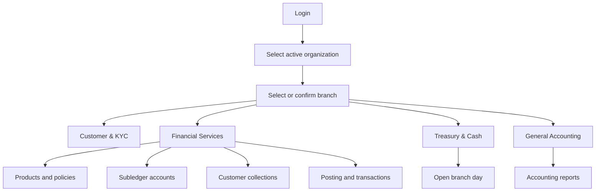
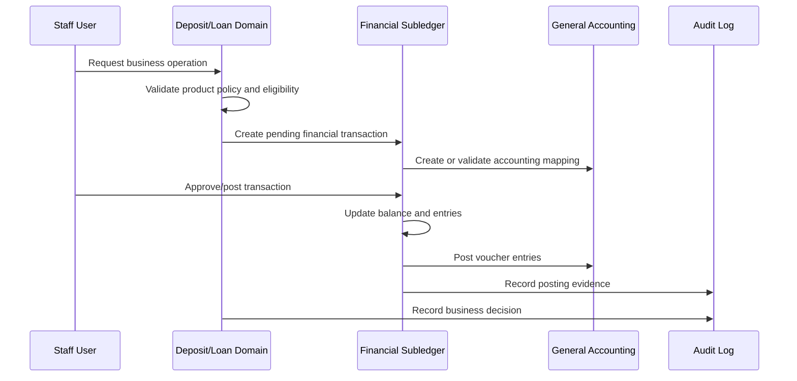

# Cooperative Credit Union Use Cases and Flows

This document describes the main user journeys for the cooperative credit union application. It follows the current module boundaries, fresh-database migration plan, financial subledger design, KYC rules, deposit ownership rules, and collection workflow.

## 1. Actors

| Actor                    | Responsibilities                                                                     |
| ------------------------ | ------------------------------------------------------------------------------------ |
| System administrator     | Organizations, branches, users, roles, permissions, backups, audits                  |
| Branch manager           | Branch-day control, approvals, cash oversight, product and policy approval           |
| Customer service officer | Customer registration, KYC records, deposit account opening, nominee and holder data |
| KYC officer              | Address, family, introducer, and document verification                               |
| Teller                   | Cash deposits, withdrawals, transfers, receipts, cash counts                         |
| Loan officer             | Loan applications, document review, collateral, guarantors, schedules, arrears       |
| Accountant               | Chart of accounts, vouchers, postings, reversals, reconciliations, reports           |
| Collection officer       | Customer search, dues review, payment collection, promises, follow-up actions        |
| Auditor                  | Audit history, transaction review, policy and approval evidence                      |
| Customer                 | Account holder, joint holder, member, borrower, nominee, guarantor                   |

## 2. Core Invariants

1. Every operational record is scoped to an organization and, where applicable, a branch.
2. `financial_accounts` is the balance subledger. Deposit and loan tables describe business lifecycle and do not duplicate balances.
3. `financial_transactions` and their entries are the source of financial movement history.
4. Posted transactions are immutable. Corrections use reversals.
5. Every product must have an approved accounting mapping before it can be used operationally.
6. Savings, fixed-deposit, and recurring-deposit accounts may have joint holders.
7. Share accounts have one member owner and cannot have joint holders.
8. An individual minor account holder requires an adult individual guardian.
9. Organization customers may own deposit and loan accounts.
10. Approval, waiver, fine, interest, dividend, and reversal actions are auditable.
11. Scheduled assessments and postings must be idempotent for the same business date and period.

## 3. Application Navigation Flow

## 4. Organization and Branch Setup

### Use case: Create organization and branches

**Primary actor:** System administrator

**Flow:**

1. Create the organization.
2. Create one or more branches.
3. Assign users to the organization and branch.
4. Assign roles and permissions.
5. Configure organization-level products, policies, and accounting mappings.
6. Confirm the active organization and branch context.

**Rules:**

- Users must not see records outside their organization.
- Branch operations require a branch context.
- Product and policy configuration is organization-specific.

## 5. Product and Policy Setup

### Use case: Configure a financial product

**Primary actor:** Branch manager or product administrator

**Flow:**

1. Open Financial Services > Deposit, Share & Loan Products.
2. Create or edit the product identity:
    - Code
    - Name
    - Category
    - Balance type
    - Base interest rate
    - Interest calculation
    - Interest frequency
3. Save the product as active or inactive.
4. Open Product Policies > Configure policy.
5. Enter operational limits and rules:
    - Opening and deposit limits
    - Loan ceiling and loan-to-value percentage
    - Eligibility rules
    - Tenure and repayment rules
    - Security and documentation rules
    - Maturity examples
    - Fine and default-related settings
6. Set version, effective dates, source, notes, and policy status.
7. Configure financial product account mappings for deposits, withdrawals, interest, fees, disbursements, and repayments.
8. Activate the product only after the policy and required mappings are valid.

**Alternative flows:**

- A missing policy leaves the product unusable for account opening.
- A retired policy cannot be used for new accounts.
- A future-effective policy is not used before its effective date.
- Policy changes create an auditable version or controlled update according to the policy strategy.

## 6. Customer and KYC

### Use case: Register a customer

**Primary actor:** Customer service officer

**Flow:**

1. Search for duplicate phone, email, identity, or organization data.
2. Select customer type: individual or organization.
3. Enter identity, contact, and organization/branch data.
4. Upload the photo and initial KYC documents.
5. Create the customer and initial KYC profile at `MINIMAL`.
6. Show pending verification tasks.

### Use case: Verify KYC evidence

**Primary actor:** KYC officer

**Flow:**

1. Open the pending address, family relation, introducer, or document queue.
2. Review the evidence.
3. Approve or reject with a reason.
4. Recalculate `primary_verified`, `other_verified`, and `kyc_level`.

**KYC level progression:**

- `MINIMAL`: no qualifying verified evidence
- `BASIC`: verified photo and identification or organization registration document
- `STANDARD`: BASIC plus verified current and permanent addresses
- `FULL`: STANDARD plus verified introducer
- `ENHANCED`: FULL plus family evidence for individuals or additional business evidence for organizations

**Organization rules:**

- Organization registration documents such as trade license and incorporation documents are primary identification evidence.
- Family relations do not apply to organization KYC.

## 7. Deposit Account Opening

### Use case: Open an individual savings account

**Primary actor:** Customer service officer

**Flow:**

1. Select an active savings product.
2. Select the primary customer.
3. Enter account number and account name.
4. Enter opening amount if required by policy.
5. Confirm the customer satisfies product eligibility and KYC requirements.
6. Create the shared `financial_account`.
7. Create the `deposit_account` lifecycle record.
8. Create a PRIMARY holder record.
9. Keep the account pending until required approval and opening deposit steps are complete.
10. Activate the account after approval.

### Use case: Open a joint savings, fixed, or recurring deposit

**Primary actor:** Customer service officer

**Flow:**

1. Select a savings, fixed-deposit, or recurring-deposit product.
2. Select the primary holder.
3. Select one or more joint holders.
4. Set ownership percentages if the product requires allocation tracking.
5. Validate that the primary holder is not duplicated as a joint holder.
6. Create the financial account and deposit account.
7. Create PRIMARY and JOINT holder records.
8. Add nominees separately from holders.
9. Activate after approvals and required opening transaction.

**Rules:**

- Joint holders are allowed only for savings, fixed deposits, and recurring deposits.
- Share accounts cannot have joint holders.
- Loan accounts use borrower, guarantor, and collateral relationships instead of deposit joint ownership.

### Use case: Open a minor account

**Primary actor:** Customer service officer

**Flow:**

1. Select an individual minor as the primary holder.
2. The UI identifies the holder as a minor from date of birth.
3. Select an adult individual guardian.
4. Reject the same person as both minor and guardian.
5. Reject an organization or another minor as guardian.
6. Store guardian metadata on the holder record.
7. Continue normal approval, opening deposit, and account activation flow.

### Use case: Open an organization account

**Primary actor:** Customer service officer

**Flow:**

1. Select an organization customer.
2. Select a valid savings, fixed, recurring, or other organization-supported product.
3. Validate organization KYC and registration documents.
4. Create the financial account and deposit account.
5. Store the organization as the primary holder.
6. Add authorized persons or operating mandates through a future authorized-person workflow, not as family relations.

## 8. Membership and Share Account

### Use case: Become a member after savings operation

**Primary actor:** Customer service officer or branch manager

**Flow:**

1. Identify a customer with an eligible savings account.
2. Confirm the account has operated for at least six months according to policy.
3. Confirm the customer is not blocked, closed, or otherwise ineligible.
4. Approve membership eligibility.
5. Open a single-owner share account.
6. Create the member number and membership record.
7. Post the share deposit through the normal financial transaction and accounting workflow.

**Rules:**

- A share account requires membership eligibility.
- A share account is owned by one customer/member.
- Share dividend eligibility is based on approved product and dividend policy.

## 9. Fixed Deposit

### Use case: Open a fixed deposit

**Primary actor:** Customer service officer

**Flow:**

1. Select an active fixed-deposit product and policy.
2. Select the primary or joint holders.
3. Enter principal, term, maturity instruction, and payout details.
4. Calculate and display expected maturity amount.
5. Create the fixed-deposit lifecycle record.
6. Post the principal deposit.
7. Activate the financial account and fixed deposit.
8. At maturity, execute payout, renew principal, or renew principal and interest according to instruction.
9. Record premature closure separately when approved.

## 10. Recurring Deposit

### Use case: Open and service a recurring deposit

**Primary actor:** Customer service officer or teller

**Flow:**

1. Select a recurring-deposit product and policy.
2. Select holders and, if applicable, a guardian.
3. Set installment amount, frequency, number of installments, grace period, and maturity date.
4. Generate installment records.
5. Post each installment through the normal transaction workflow.
6. Mark installments as paid, partial, missed, or waived.
7. Assess default fines after grace period.
8. Extend maturity when policy permits.
9. Mature and settle the account according to product instruction.

## 11. Loan Application and Approval

### Use case: Apply for a loan

**Primary actor:** Loan officer

**Flow:**

1. Select the customer and loan product.
2. Validate KYC, customer status, and product eligibility.
3. For a general loan, confirm an eligible share account.
4. Enter requested amount, term, purpose, and supporting documents.
5. Add collateral and guarantors when required.
6. Submit the application.
7. Create approval steps and route to authorized reviewers.
8. Approve, reject, or return the application with an audit record.

### Use case: Create and disburse a loan

**Primary actor:** Loan officer and accountant

**Flow:**

1. Convert an approved application into a loan account.
2. Create the loan financial account.
3. Copy approved principal, rate, calculation method, term, and maturity data.
4. Create the loan schedule and schedule components.
5. Create the protection policy when required.
6. Create a pending disbursement transaction.
7. Post the transaction through accounting and financial subledger rules.
8. Mark the loan active after successful posting.

## 12. Loan Repayment

### Use case: Receive a loan repayment

**Primary actor:** Teller or collection officer

**Flow:**

1. Search for the customer or loan number.
2. Display the next schedule, overdue arrears, interest, fines, and protection charges.
3. Enter the payment amount and source.
4. Allocate the payment according to product policy, for example:
    - Fines and fees
    - Protection charges
    - Interest
    - Principal
5. Create repayment allocation records.
6. Post the financial transaction.
7. Update schedule component status and loan arrears.
8. Issue a receipt.

**Rules:**

- Allocation must be deterministic and recorded per component.
- Partial payments are supported.
- Reversals reverse allocations and financial postings rather than editing history.

## 13. Default and Fine Assessment

### Use case: Assess daily defaults

**Primary actor:** Scheduled system job

**Flow:**

1. Select active deposit and loan accounts with due obligations.
2. Apply grace periods from the product or account default rule.
3. Create one default event per account, rule, and due date.
4. Calculate fixed or percentage fines.
5. Create an immutable fine assessment with its calculation basis.
6. Extend recurring-deposit maturity when the rule allows it.
7. Notify staff or customer according to notification policy.

**Manual exception flow:**

- Authorized staff may waive or reverse a fine.
- The waiver requires a reason and audit record.
- Re-running the same date does not duplicate the event or fine.

## 14. Interest Provisioning

### Use case: Provision deposit interest

**Primary actor:** Scheduled system job and accountant

**Flow:**

1. Identify eligible deposit accounts and the active product policy.
2. Calculate interest for the accounting period using the configured basis and rate.
3. Create one interest provision per account and period.
4. Review and approve provisions.
5. Post approved interest through financial transactions and accounting mappings.
6. Create an interest posting record.
7. Reverse through an explicit reversal flow when necessary.

## 15. Share Dividend

### Use case: Declare and allocate share dividend

**Primary actor:** Branch manager, board-approved authority, and accountant

**Flow:**

1. Select the fiscal year.
2. Enter the approved dividend rate.
3. Calculate eligible share-account basis amounts.
4. Create one declaration for the organization and fiscal year.
5. Review and approve the declaration.
6. Create per-share-account allocations.
7. Post allocations through financial transactions and accounting.
8. Mark the declaration and allocations as posted.
9. Reverse only through an explicit accounting reversal process.

## 16. Branch-Day and Treasury Flow

### Use case: Open and close branch day

**Primary actor:** Branch manager

**Flow:**

1. Open the business date.
2. Record opening cash by vault and teller.
3. Open teller sessions.
4. Perform deposits, withdrawals, transfers, petty-cash, bank, and cheque operations.
5. Count cash and reconcile expected versus actual amounts.
6. Resolve or approve shortages and excesses.
7. Close teller sessions.
8. Close the branch day only after reconciliation checks pass.

**Rules:**

- Cash transactions require an open branch day.
- Teller sessions belong to a branch day.
- Cash movement and reconciliation records are not deleted after posting.

## 17. Customer Collection

### Use case: Review all customer obligations

**Primary actor:** Collection officer

**Flow:**

1. Open Financial Services > Customer Collections.
2. Search by customer number, name, phone, deposit account number, or loan number.
3. Select the customer.
4. Display:
    - All deposit accounts and balances
    - Joint-held deposit accounts
    - Deposit defaults and fines
    - Fixed-deposit maturity information
    - Recurring-deposit installments and missed payments
    - All loan accounts
    - Next loan schedules
    - Principal and interest due
    - Arrears and fines
    - Loan protection initial or renewal fees
5. Select the obligation to collect.
6. Enter payment amount.
7. Allocate the payment to the correct components.
8. Post through the standard transaction workflow.
9. Print or display a receipt.
10. Record a collection action or promise when payment is deferred.

## 18. Accounting Posting Boundary

Every money-changing use case follows this boundary:

The domain module decides whether an operation is valid. The financial subledger owns account balances and transaction entries. General Accounting owns the double-entry voucher and reporting layer.

## 19. Exception and Recovery Flows

### Rejected KYC

- Keep the customer and evidence record.
- Record rejection reason.
- Allow correction and resubmission.
- Do not count rejected evidence toward KYC level.

### Reversed transaction

- Keep the original posted transaction.
- Create a reversal event or reversal transaction.
- Restore balances through the transaction service.
- Recalculate affected schedules, arrears, fines, or provisions.

### Failed scheduled job

- Retry using the same business date and idempotency key.
- Do not create duplicate default events, fines, interest provisions, or dividend allocations.
- Record job failure and retry information.

### Policy changed after accounts exist

- Existing accounts retain their approved account terms where required.
- New accounts use the currently effective policy.
- Repricing or migration requires an explicit authorized workflow.
- Historical calculations retain the policy version used.

## 20. Minimum Acceptance Scenarios

1. Create an organization, branch, staff role, and active savings product with policy and accounting mappings.
2. Register an individual customer, complete KYC, and open a savings account.
3. Open a joint fixed deposit for two customers and display it for both holders in Collection.
4. Open a minor recurring deposit with an adult guardian and reject an invalid guardian.
5. Open an organization savings account using organization KYC documents.
6. Operate a savings account for six months and open a single-owner share account.
7. Open a loan against an eligible share account, disburse it, and generate its schedule.
8. Miss a recurring installment, assess a fine, and extend maturity once.
9. Collect a partial loan payment and verify component allocation.
10. Provision interest, approve it, post it, and safely rerun the job.
11. Declare and allocate share dividends for a fiscal year.
12. Open a branch day, perform teller operations, reconcile cash, and close the day.
13. Search the customer collection page and verify all balances, dues, fines, arrears, and protection fees.
